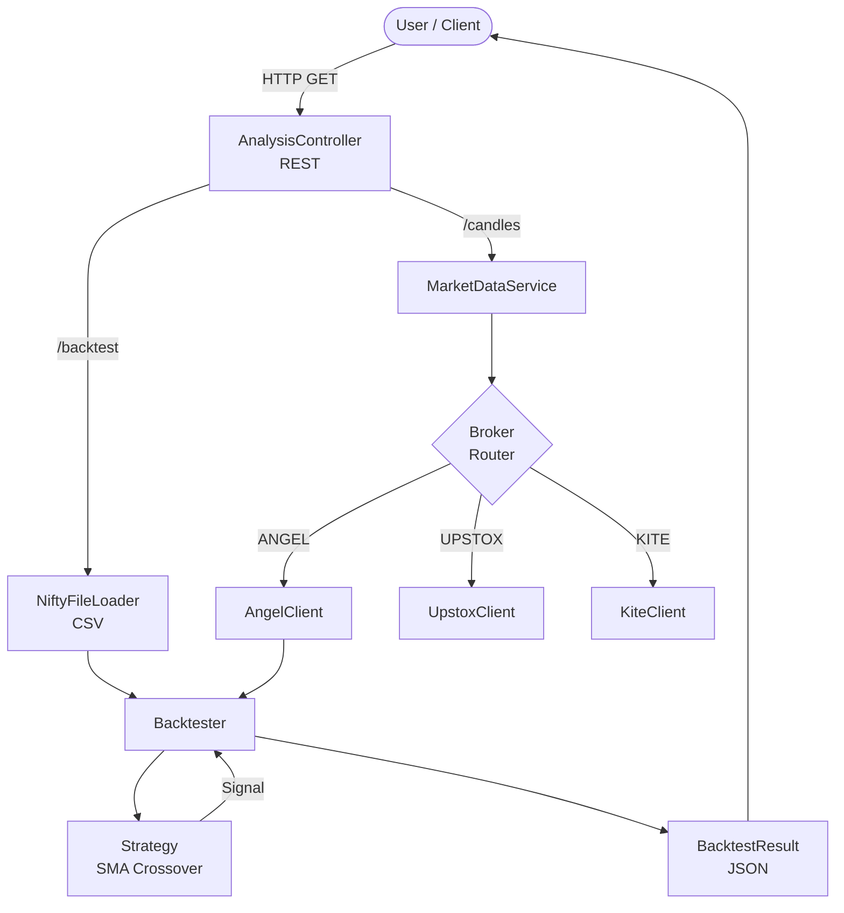
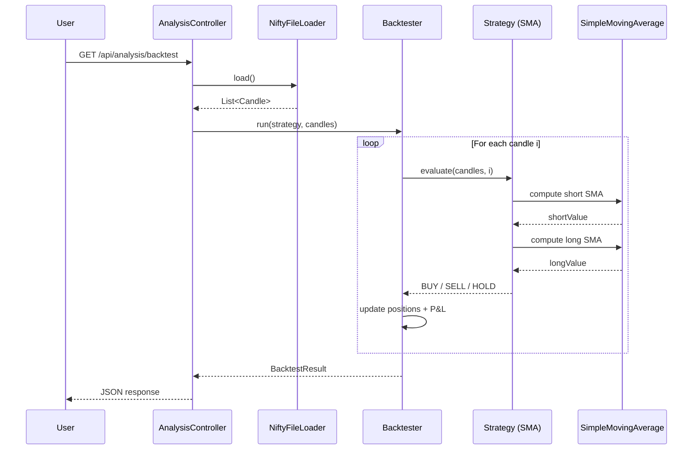
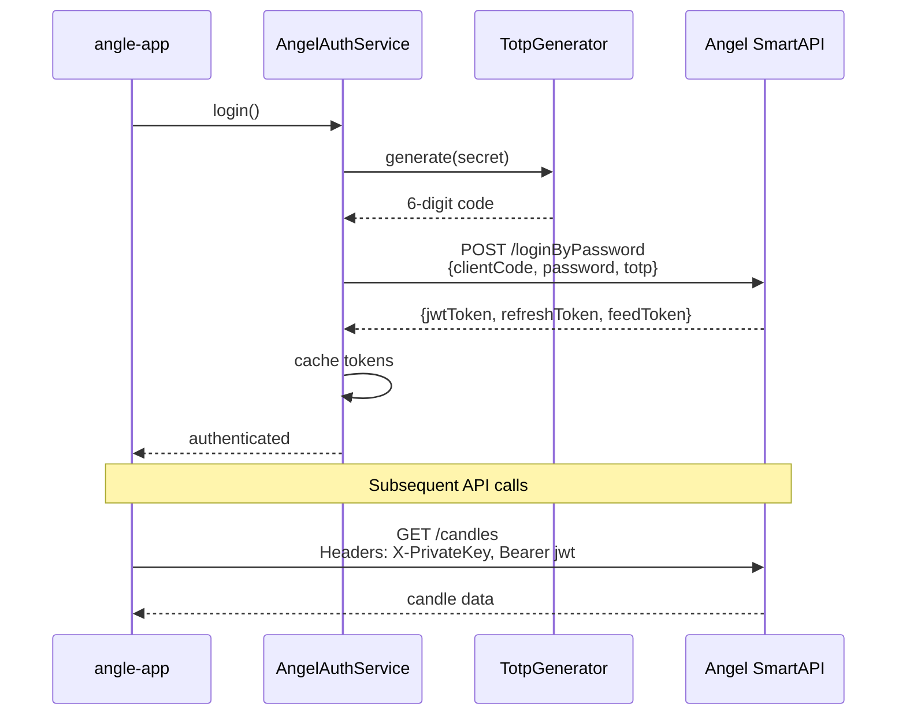
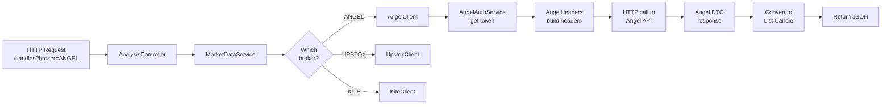
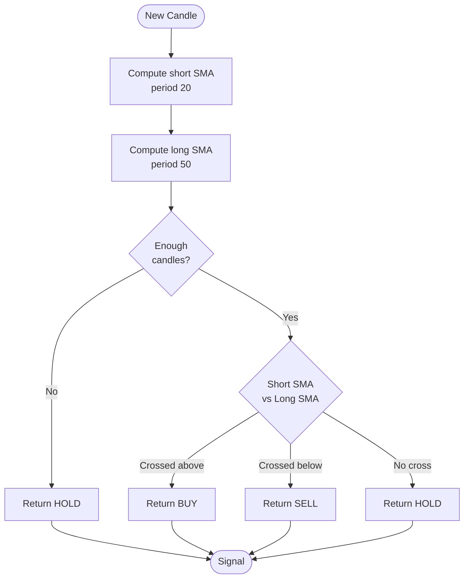
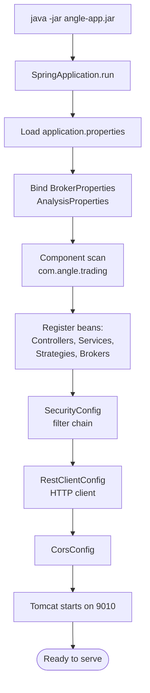
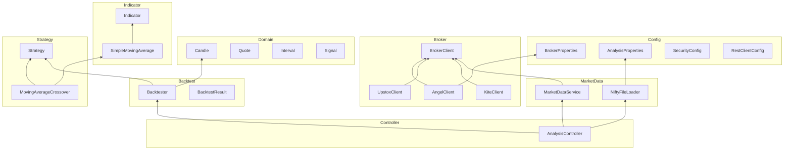
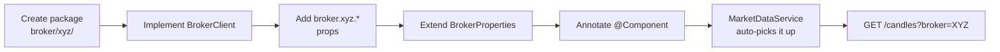

# Flow Diagrams

Visual flows of how the angle-app works.
(Rendered with Mermaid — view on GitHub or any Mermaid-aware viewer.)

---

## 1. High-Level System Flow



---

## 2. Backtest Flow



---

## 3. Angel One Auth Flow (with TOTP)



---

## 4. Live Candles Fetch Flow



---

## 5. Strategy Decision Flow (SMA Crossover)



---

## 6. Application Startup Flow



---

## 7. Package / Layer Dependency



---

## 8. Adding a New Strategy (Developer Flow)

```mermaid
flowchart LR
    A[Create class<br/>strategy/impl/MyStrategy.java] --> B[Implement Strategy]
    B --> C[Annotate<br/>@Component]
    C --> D[Return unique<br/>getName]
    D --> E[Set property<br/>analysis.strategy.default]
    E --> F[Restart app]
    F --> G[GET /backtest<br/>uses new strategy]
```

---

## 9. Adding a New Broker (Developer Flow)


