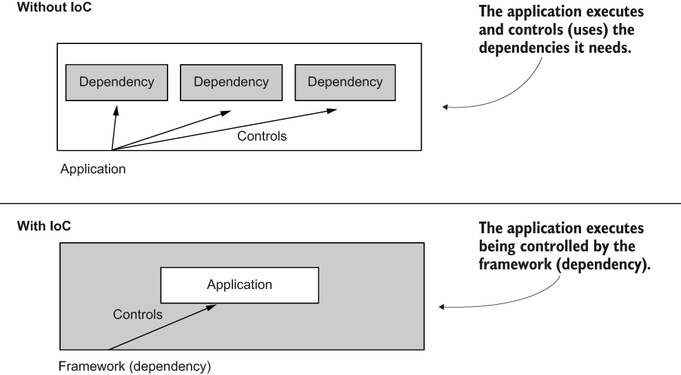

**What is ioc ?**

    Without IoC: I control and wire everything myself.
    With IoC: Framework controls wiring; I just declare what I need and let it be injected.

**How Beans Are Created in Spring?**

    Using @Component Annotation: Spring automatically scans packages and creates beans for classes with annotations
    Using @Bean Annotation :declare a bean inside a @Configuration class ,@Bean is useful for third-party classes or complex creation logic that we can't annotate directly
    XML Configuration (Old Style)
    @ComponentScan:We use it to tell Spring where to look for annotated beans if they are not in the same package or sub-packages of the configuration class. In Spring Boot it’s often not needed, unless beans are outside the default scan path
    
    Bean Creation Process in Spring
    When Spring starts:
    
    1:Container Initialization
        Creates an IoC container (ApplicationContext).
    2:Scan for Bean Definitions
        From XML
        From Java Config (@Configuration)
        From Component Scanning (@Component, @Service, etc.)
    3:Bean Instantiation
        Creates object instances (by calling constructor or factory method).
    4:Dependency Injection (@Autowired, constructor injection, setter injection)
    5:Lifecycle Callbacks
        @PostConstruct
        Implementing InitializingBean or defining init-method
    6:Bean Ready to Use
    
    Advanced Bean Creation
        Conditional Beans: Use @Conditional or @ConditionalOnMissingBean
        Lazy Beans: Use @Lazy to defer creation
        Profiles: Use @Profile("dev") for environment-specific bean creation

    When multiple beans of the same type exist:

    Use @Primary to pick a default
    Or use @Qualifier with the bean name to pick a specific bean.

    @Component annotation over the class, we instruct Spring to create an instance of this class and add it to its context.

    Advantages and disadvantages: A comparison of the two ways of adding beans to the Spring context, which tells you when you would use either of them
    
    Using the @Bean annotation
    You have full control over the instance creation you add to the Spring context. It is your responsibility to create and configure the instance in the body of the method annotated with @Bean. Spring only takes that instance and adds it to the context as-is.
    You can use this method to add more instances of the same type to the Spring context. Remember, in section 2.1.1 we added three Parrot instances into the Spring context.
    You can use the @Bean annotation to add to the Spring context any object instance. The class that defines the instance doesn’t need to be defined in your app. Remember, earlier we added a String and an Integer to the Spring context.
    You need to write a separate method for each bean you create, which adds boilerplate code to your app. For this reason, we prefer using @Bean as a second option to stereotype annotations in our projects.
    
    Using stereotype annotations
    You only have control over the instance after the framework creates it.
    This way, you can only add one instance of the class to the context.
    You can use stereotype annotations only to create beans of the classes your application owns. For example, you couldn’t add a bean of type String or Integer like we did in section 2.1.1 with the @Bean annotation because you don’t own these classes to change them by adding a stereotype annotation.
    Using stereotype annotations to add beans to the Spring context doesn’t add boilerplate code to your app. You’ll prefer this approach in general for the classes that belong to your app.
    
    What you’ll observe is that in real-world scenarios you’ll use stereotype annotations as much as possible (because this approach implies writing less code), and you’ll only use the @Bean when you can’t add the bean otherwise (e.g., you create the bean for a class that is part of a library so you cannot modify that class to add the stereotype annotation).
    Using @PostConstruct to manage the instance after its creation

**What is @PostConstruct**

    When Does it Run?
    Spring creates your bean (@Component, @Bean, etc.).
    Spring injects all dependencies (@Autowired, etc.).
    THEN Spring calls any method annotated with @PostConstruct.

    it’s called only once per bean lifecycle, just after initialization.

    Important Rules
    Method must be void.
    Takes no arguments.
    Runs once after bean initialization.
    Exceptions thrown will stop context startup.
    Works only on Spring-managed beans (retrieved from context, not manually created with new).

    Difference from InitializingBean.afterPropertiesSet()
    @PostConstruct: Annotation + simpler, no interface needed.
    afterPropertiesSet(): Comes from Spring's InitializingBean interface, must override method.
    Both do the same thing (called after bean is initialized), but @PostConstruct is preferred for simplicity.

**Spring Bean Lifecycle**

    1. Bean Definition Loaded
    └─ Spring scans @Component/@Service/@Bean/@Configuration classes
    and creates Bean Definitions in the ApplicationContext.
    
    2. Bean Instantiation
       └─ Spring calls the constructor of your bean class.
    
    3. Dependency Injection
       └─ @Autowired fields, constructor args, @Value properties are set.
    
    4. Bean Initialization
          └─ If the bean implements BeanNameAware, BeanFactoryAware, etc.,
          Spring calls those "Aware" methods.
    
    5. @PostConstruct Method Execution
          └─ Spring calls methods annotated with @PostConstruct, once per bean,
          after dependencies are injected.
          ✅ THIS is where you put initialization logic.
    
    6. InitializingBean.afterPropertiesSet()
          └─ If the bean implements InitializingBean, this method runs
          (after PostConstruct).
    
    7. Custom init-method
          └─ If defined in @Bean(initMethod="...") or XML <bean init-method="...">.
    
    8. Bean Ready for Use
          └─ Now the bean is in the ApplicationContext and can be injected anywhere.
    -----------------------------------------
    Later on shutdown:
    9. @PreDestroy executes for cleanup before bean removal.
       10. DisposableBean.destroy() or custom destroy-method() runs.

**How Programmatically adding beans to the Spring context?**

    Spring normally auto-detects beans via
    
    @Component scanning
    @Bean methods in @Configuration classes
    …but sometimes you want to register beans at runtime

    Use ConfigurableApplicationContext#getBeanFactory()
    If you have the ApplicationContext and it’s configurable, you can call registerSingleton() or registerBeanDefinition()

    Using GenericApplicationContext#registerBean()
    Implementing BeanDefinitionRegistryPostProcessor

    By declaring in @Bean methods dynamically

    Things to keep in mind
    Programmatically added beans won’t be scanned by @ComponentScan — you have to register them manually.
    Lifecycle annotations (@PostConstruct, @PreDestroy) will still run for beans created through bean definitions (registerBean or registry post processor).
    If you use registerSingleton with a pre-built instance, Spring will not run its init methods because instance is already created.

**Q:  why  @RestController we used in restapi? and What is @RestController?**

    @RestController is a specialized Spring annotation introduced in Spring 4
    it is essentially a shortcut for:
    
    @Controller
    @ResponseBody
    Meaning:
    
    @Controller — Marks the class as a Spring MVC controller (to handle HTTP requests).
    @ResponseBody — Combines with method results so that return values are written directly to the HTTP response body instead of rendering a view.
    
    Why it's important for REST APIs
    REST APIs don’t serve HTML views — they return data (JSON, XML, etc.)
    The method’s return object is automatically converted to JSON (or XML) using HttpMessageConverters 

**Q : JSON Flow Diagram**

    HTTP Client (Browser / Postman / Mobile App)
                           |
                           v
                 Spring DispatcherServlet
                 (Front Controller in MVC)
                           |
                           v
               HandlerMapping finds the right method
               (matching URL + HTTP method)
                           |
                           v
             Call method inside @RestController class
                           |
         ----------------- Execution -----------------
                           |
             Your method runs, returns a Java object
                           |
             |  @RestController = @Controller + @ResponseBody |
                           |
                           v
             @ResponseBody tells Spring:
             "Skip view resolver — write return value to HTTP response body"
                           |
          HTTPMessageConverter (e.g., MappingJackson2HttpMessageConverter)
               - Converts Java object → JSON (or XML)
                           |
                           v
                  HTTP Response with JSON payload
                           |
                           v
                      Back to the Client

    
