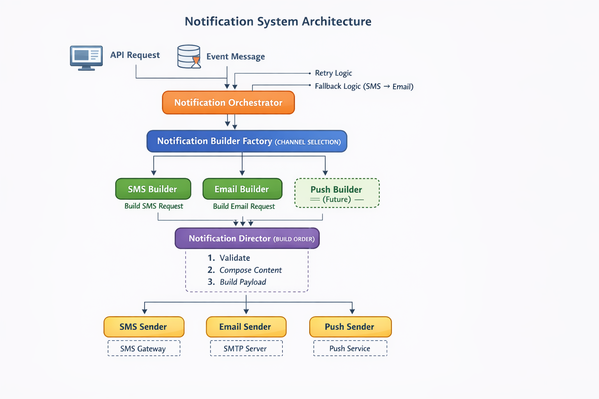
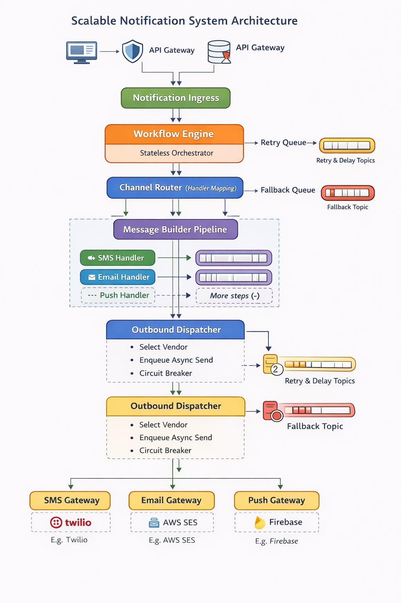

                                                    **Builder pattern** 
**Builder Pattern Structure**
Builder Pattern is used to construct complex objects step-by-step
without using large constructors or messy setters.

Product        → Object being built
Builder        → Interface / class with build steps
ConcreteBuilder→ Implements steps
Director       → (Optional) controls building steps

🧠 When to Use Builder Pattern
Use it when:
Object has many optional fields
You want immutable objects
You want readable object creation
Construction logic is complex
❌ Don’t use it for very small/simple objects

Problem it solves
❌ Too many constructor parameters
❌ Hard to read code
❌ Optional fields become confusing
❌ Object creation logic gets messy

🆚 Builder vs Other Patterns
| Pattern   | Purpose                     |
| --------- | --------------------------- |
| Factory   | Creates object in one step  |
| Builder   | Creates object step-by-step |
| Prototype | Clone existing object       |
| Singleton | One instance only           |

✅ Where Builder Pattern is Used
Lombok @Builder (very common in Spring Boot)
HTTP request builders
SQL query builders
UI component builders
Test data builders

🧩 Builder + Immutability (Best Practice)
Make fields final
No setters
Only Builder can create object
✔ Thread-safe

Types:
there isn’t one single “official” number, but in practice Builder Pattern is commonly seen in 3 main types

✅ 1️⃣ Classic (Separate) Builder Pattern
👉 GoF (Gang of Four) style
“Classic Builder Pattern is best used when the same construction process needs to create different representations
Classic Builder = process same, product different
Structure
Product
Builder interface
ConcreteBuilder
Director (optional)
Director → Builder → Product

✔ Use Classic Builder for:
Document builders
Report generators
UI layout builders

PDF / Excel generation services
Email template builders
Notification builders (SMS / Email / Push)
Document export modules

❌ Do NOT use for:
JPA Entities
Request/Response DTOs
Simple domain models

✅ 2️⃣ Fluent / Inner Builder (Most Common Today)
👉 Modern Java / Web apps

Structure
Builder is a static inner class
Method chaining (fluent API)

When used
Many optional fields
Clean, readable code
Immutable objects

Real use
Lombok @Builder
DTOs
Entity creation
📌 Most popular in Spring Boot & modern apps

✅ 3️⃣ Step Builder Pattern
👉 Enforces build order

Idea
Object must be built step-by-step
Prevents missing mandatory fields

When used
Mandatory fields required
Wrong order can cause bugs

Real use
Payment flows
Configuration objects
📌 Best for safety & correctness

⚠️ 4️⃣ Faceted Builder (Less Common, Advanced)
👉 Used when object has multiple independent parts
Example
User → personal info + address + preferences

🧩 Director vs Service Layer (Important)
| Director           | Service          |
| ------------------ | ---------------- |
| Construction logic | Business logic   |
| Step ordering      | Use cases        |
| Pattern role       | Application role |
👉 Director is NOT a Service replacement.

| Pattern         | Best Use                     |
| --------------- | ---------------------------- |
| Classic Builder | Same steps, different output |
| Fluent Builder  | Optional fields              |
| Step Builder    | Mandatory order              |
| Factory         | One-step creation            |

🔑 Key Insight

➡️ Factory decides WHAT object to create
➡️ Builder decides HOW to build the object

❓ Is Director Mandatory?
❌ NO — Director is OPTIONAL
When you CAN skip Director
Simple Fluent Builder

🏭 Factory Pattern — Components
When to Use Factory
✔ Multiple implementations
✔ Object selection logic

| Component            | Role                       | Responsibility                     |
| -------------------- | -------------------------- | ---------------------------------- |
| **Product**          | Interface / abstract class | Defines common behavior            |
| **Concrete Product** | Implementation class       | Actual object created              |
| **Factory**          | Creator class              | Decides **which object** to create |
| **Client**           | Calling code               | Uses factory, not concrete classes |

🔨 Builder Pattern — Components (Classic Builder)

| Component                 | Role           | Responsibility                |
| ------------------------- | -------------- | ----------------------------- |
| **Product**               | Final object   | Complex object being built    |
| **Builder**               | Interface      | Declares build steps          |
| **Concrete Builder**      | Implementation | Implements each build step    |
| **Director** *(optional)* | Orchestrator   | Controls **order of steps**   |
| **Client**                | Calling code   | Triggers the building process |

🧩 Step Builder vs Bean Validation

| Aspect     | Step Builder       | Bean Validation  |
| ---------- | ------------------ | ---------------- |
| Error type | Compile time       | Runtime          |
| Layer      | Service / Domain   | Controller / DTO |
| Use case   | Domain correctness | Input validation |

🔥 Lombok + Builder

| Case            | Recommendation      |
| --------------- | ------------------- |
| Fluent Builder  | Lombok `@Builder` ✔ |
| Step Builder    | Lombok ❌ (manual)   |
| Classic Builder | Lombok ❌            |

📌 Interview gold line:
User-critical notifications are synchronous, system-generated notifications are asynchronous.
Idempotency design
👉 Orchestrator never breaks abstraction layers
“Orchestrator manages workflow, not business logic.
🔹 Orchestrator vs Saga
🔹 Stateless vs stateful orchestrator
🔹 Idempotency handling
🔹 DLQ integration

🔹 SenderFactory vs DI

🔹 Multiple vendors per channel
