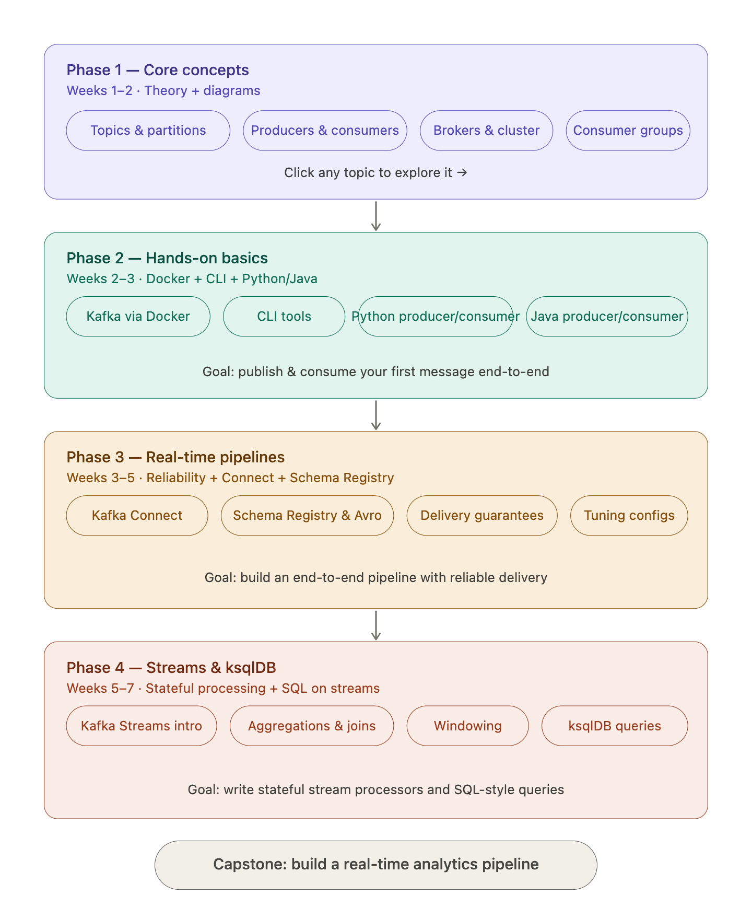
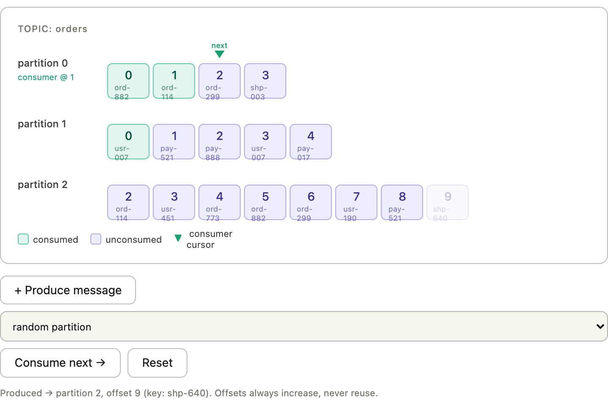

### what is Kafka ? ##
Kafka is one of the most popular platforms for event-based architecture.Apache Kafka is a distributed event streaming platform.

An event-based system (also called event-driven architecture – EDA) is a software design pattern 
where different components communicate by producing and responding to events, instead of calling each other directly.

**Why Use Event-Based Architecture?**
✔️ Loose Coupling :Services don’t call each other directly. They just send/receive events.
✔️ Scalability :Each service can scale independently.
✔️ Asynchronous Processing  : Events can be processed later; no need to wait.
✔️ Reliability : If one service is down, events remain in the broker (Kafka) until the service comes back.
✔️ Real-time Data Flow

**Rule to Remember**

| If you need response immediately                  | → **Use Direct API (non-event-based)** |
| ------------------------------------------------- | -------------------------------------- |
| If work can happen later                          | → **Use Event-Based (Kafka)**          |
| If multiple systems need same data                | → **Use Event-Based**                  |
| If only one system needs response                 | → **Use Direct API**                   |
| If system must not fail even if services are down | → **Use Event-Based**                  |

**What it does:**
Handles real-time data streams (like logs, events, messages)
Works like a high-speed message pipeline
Used in large systems (Netflix, Uber, banks, etc.)

**Key idea:**
Think of Kafka as a central nervous system for data
→ Apps send events → Kafka stores & distributes them

# Explain Kafka topics, partitions and offsets with a diagram 

A topic is just a named category of events. You create one called orders (or user-signups, or payments) and producers write messages to it. Think of it as a named channel — producers don't care who's listening, and consumers don't care who wrote the data.
Partitions are how a topic stores messages — in parallel. Every topic is split into N partitions (you choose how many when you create the topic). Each partition is an independent, ordered log. Messages in partition 0 have no relationship to messages in partition 1. This is Kafka's key trick for scalability: multiple consumers can read from different partitions at the same time, in parallel.
Two important rules about partitions:

* Messages within a single partition are always ordered and immutable — once written, they never change.
* Messages written to different partitions have no guaranteed order between them.

Offsets are the position of a message within its partition. Every message that lands in partition 0 gets assigned offset 0, then 1, then 2, and so on — forever. Offsets never repeat, never reset (unless you explicitly delete old data). This is how Kafka tracks "where you are" in the log.
Here's the crucial thing about consumer offsets: a consumer doesn't delete messages by reading them. It simply remembers the last offset it successfully processed. If your consumer crashes and restarts, it picks up from where it left off. You can also rewind — set the consumer back to offset 0 and re-read the entire history. This is impossible with traditional queues.

# How does Kafka decide which partition a message goes to? 

No key → round-robin
When a producer sends a message without a key, Kafka distributes messages across partitions in round-robin order. Good for throughput, but messages for the same entity (same user, same order) can land anywhere.
. If your producer sends a message without specifying a key, Kafka just cycles through partitions: 0, 1, 2, 0, 1, 2… This maximises throughput and spreads load evenly, but there's no ordering guarantee across messages. Try tab 1 in the widget above.

With a key → deterministic hashing. If you provide a key (a user ID, an order ID, a device ID), Kafka runs murmur2(key) % numPartitions and sends the message to the resulting partition. The critical property: the same key always produces the same partition number, forever. Tab 2 shows you the actual hash calculation happening live — try changing the key and watch which partition it targets.
Because the same key always hashes to the same partition, messages for that key are strictly ordered. This is how Kafka guarantees that all events for a given user, order, or device arrive in sequence.

# Explain Kafka producers and consumers with an example

A producer is any application that writes events to Kafka. It doesn't know or care who reads the data — it just fires events at a topic and moves on. In the example above, order-service produces three types of events (order-placed, payment-done, item-shipped) to the order-events topic. Each message has a key (like ord-11) that determines its partition via murmur2 hashing, and a value (the payload).
The producer's only real decisions are: which topic to write to, whether to attach a key, and how many acknowledgements to wait for before considering a write "done" (more on that in Phase 3).
A consumer is any application that reads events from Kafka. But unlike a traditional queue, reading a message doesn't destroy it. A consumer maintains a cursor (its committed offset) per partition, and Kafka just serves whatever comes after that offset on the next poll. This means:

A consumer that crashes restarts exactly where it left off.
You can replay an entire topic's history by resetting the offset back to 0.
Multiple independent consumer groups can each read the same topic without interfering with each other.

A consumer group is how Kafka scales consumption. In the widget, notifications-group has three members — email-worker, sms-worker, and push-worker. Kafka assigns each partition to exactly one member of the group. So partition 0 is owned by email-worker, partition 1 by sms-worker, and so on. If you add a fourth worker, it sits idle (there are only 3 partitions). If one crashes, Kafka rebalances and hands its partition to another member.
The "lag" badge on each consumer shows how many unconsumed messages are waiting. In production, lag is one of the most important metrics you monitor — rising lag means your consumers aren't keeping up with the producer.
Spring : KafkaTemplate (producer) and @KafkaListener (consumer)

# Explain Kafka brokers and how they form a cluster

# Explain Kafka consumer groups and why they matter

# Write a Kafka producer and consumer in Java using kafka-clients

# Explain Kafka Connect and how to use source and sink connectors