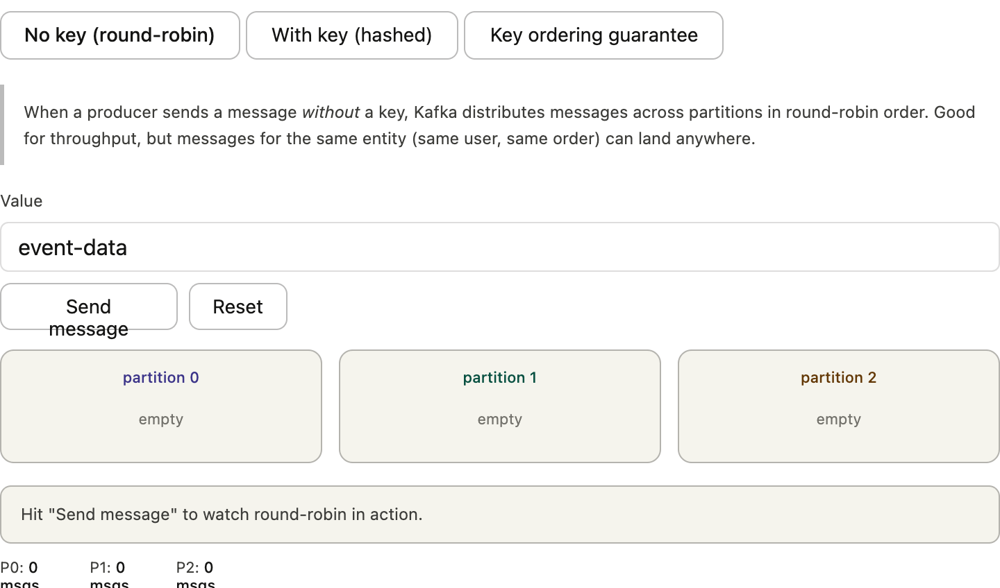
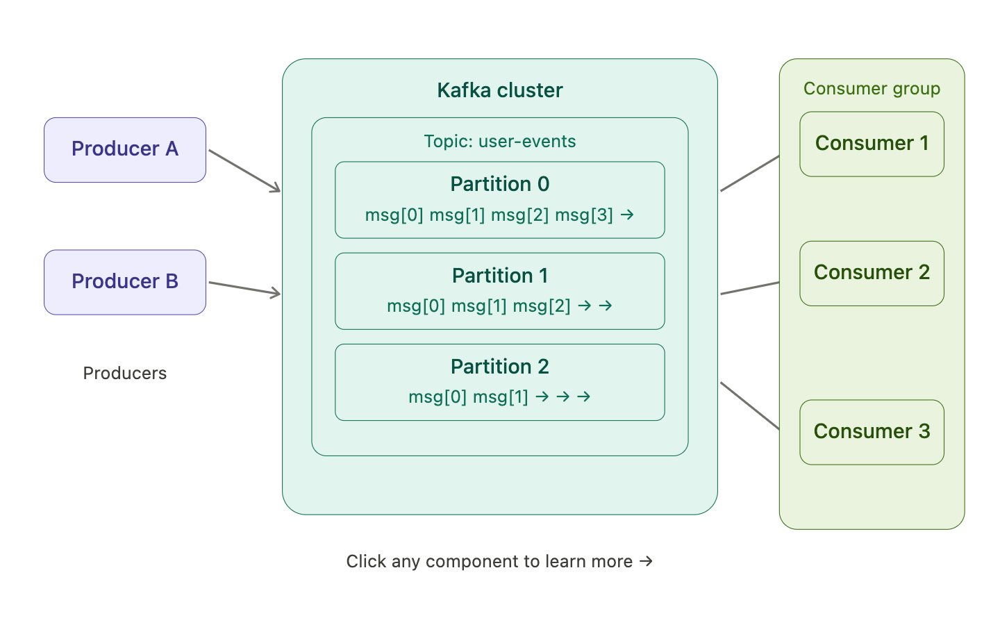
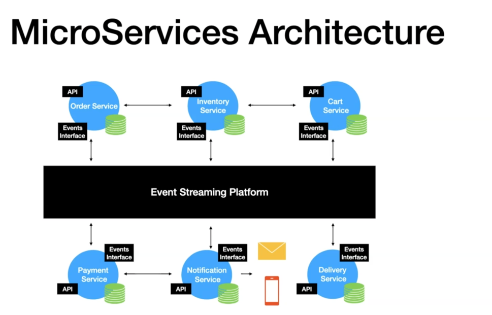
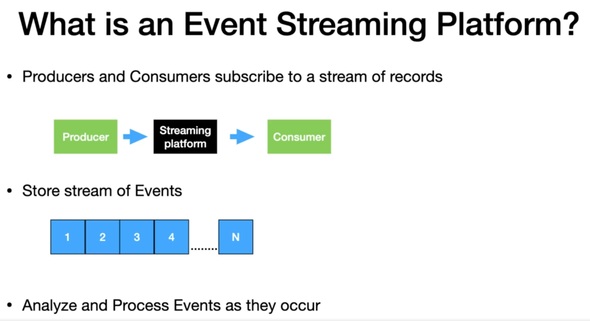
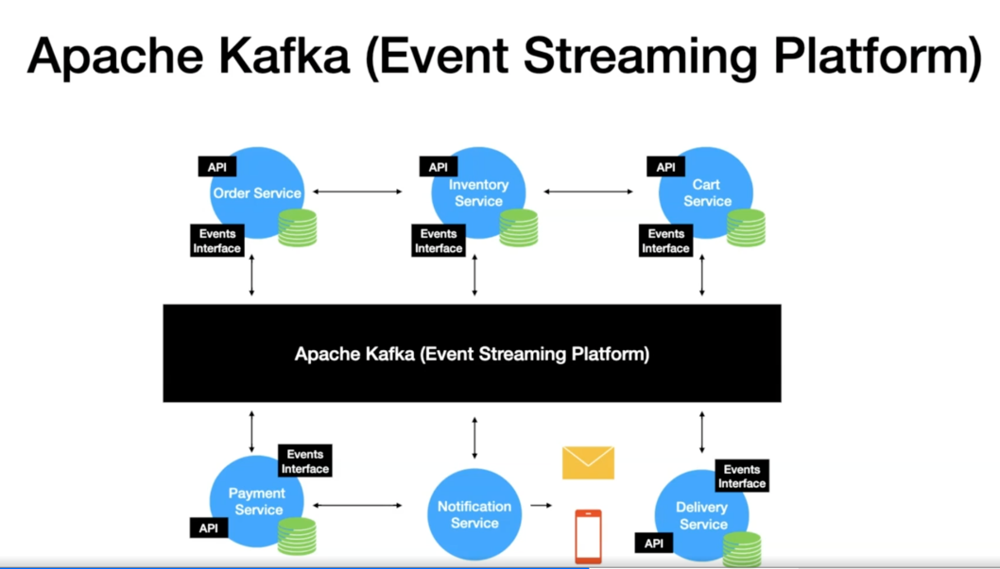
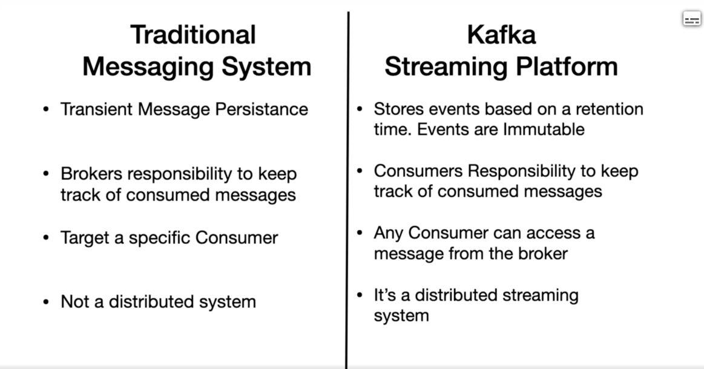

# Core Concepts
topics (named channels), 
partitions (parallelism units), 
offsets (your position in the log), 
and consumer groups (how multiple consumers divide work)

# Kafka topics, partitions and offsets
A topic is just a named category of events. You create one called orders (or user-signups, or payments) and producers write messages to it. Think of it as a named channel — producers don't care who's listening, and consumers don't care who wrote the data.

Partitions are how a topic stores messages — in parallel. Every topic is split into N partitions (you choose how many when you create the topic). Each partition is an independent, ordered log. Messages in partition 0 have no relationship to messages in partition 1. This is Kafka's key trick for scalability: multiple consumers can read from different partitions at the same time, in parallel.
Two important rules about partitions:

Messages within a single partition are always ordered and immutable — once written, they never change.
Messages written to different partitions have no guaranteed order between them.

Offsets are the position of a message within its partition. Every message that lands in partition 0 gets assigned offset 0, then 1, then 2, and so on — forever. Offsets never repeat, never reset (unless you explicitly delete old data). This is how Kafka tracks "where you are" in the log.
Here's the crucial thing about consumer offsets: a consumer doesn't delete messages by reading them. It simply remembers the last offset it successfully processed. If your consumer crashes and restarts, it picks up from where it left off. You can also rewind — set the consumer back to offset 0 and re-read the entire history. This is impossible with traditional queues.

### How does Kafka decide which partition a message goes to?

RoundRobin[no key]:
When a producer sends a message without a key, Kafka distributes messages across partitions in round-robin order. Good for throughput, but messages for the same entity (same user, same order) can land anywhere.

# ch2
event driven arch
event streaming plateform

# ch3 setup

# ch4 