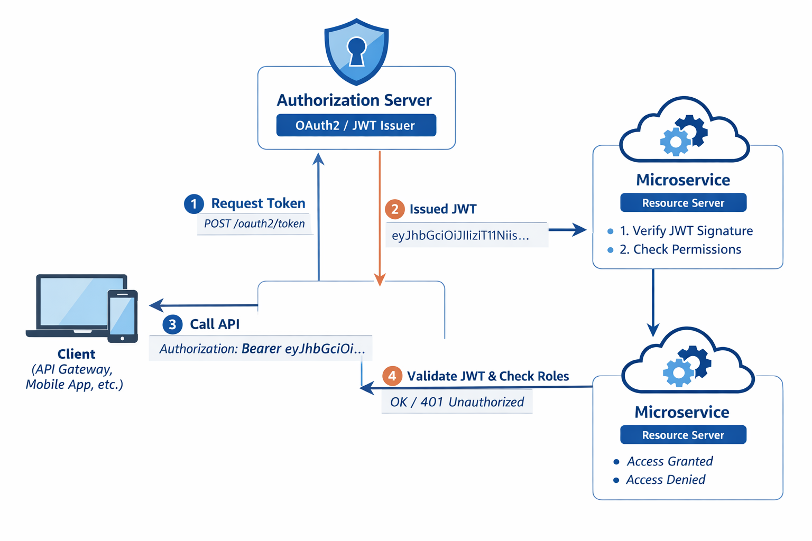

Security Fundamentals
6️⃣ Web Security Basics

Understand:
Authentication vs Authorization
Session vs Token based auth
Cookies vs JWT

7️⃣ OAuth2 + JWT (Very Important)
Access Token vs Refresh Token
Authorization Server
Client Credentials Flow
JWT structure (header, payload, signature)

8️⃣ Secure Gateway
Add OAuth2 Resource Server
JWT validation
Token relay

9️⃣ Secure Microservices
Role based access
Method level security
Token propagation between services

jwt flow :
Client → Auth Server (Keycloak) → JWT Token
Client → API Gateway (with JWT) → Microservice
Microservice → validates JWT → allows / denies

docker run -d --name keycloak \
-p 8080:8080 \
-e KEYCLOAK_ADMIN=admin \
-e KEYCLOAK_ADMIN_PASSWORD=admin \
quay.io/keycloak/keycloak:23.0.3 start-dev
http://localhost:8080
username: admin
password: admin
docker logs keycloak

Stop / Remove
docker stop keycloak
docker rm keycloak

curl -X POST http://localhost:8080/realms/retail/protocol/openid-connect/token \
-d "client_id=api-gateway" \
-d "client_secret=Mnn30O696xaaA3Jaim9F0HGWP1vCZXhV" \
-d "grant_type=client_credentials"

Order Service → Registers itself to Eureka
Gateway       → Asks Eureka “where is order-service?”
Client        → Calls Gateway
Gateway       → Forwards request to order-service

Eureka → Order Service → API Gateway

Here’s a clear diagram of how Keycloak roles, clients, and service accounts interact for your setup:
               +-----------------+
               |   Keycloak      |
               |   Realm: retail |
               +-----------------+
                       |
        -------------------------------
        |                             |
Client: api-gateway           Client: myservice
(for token request)          (your backend service)
|                             |
|                             |
|-- Service Account Roles --> ADMIN (assigned under myservice)
|                             |
|                             |
+-----------+-----------------+
|
| JWT Token (client_credentials)
|---------------->
|  Contains:
|  "resource_access": {
|      "myservice": { "roles": ["ADMIN"] }
|  }
|
+-----------------+
|   Spring Boot   |
|  myservice API  |
+-----------------+
|
@PreAuthorize("hasRole('ADMIN')")
Checks token → OK

| Component                | What it is                                                                                 |
| ------------------------ | ------------------------------------------------------------------------------------------ |
| **Client**               | API Gateway, Mobile App, Postman, Frontend                                                 |
| **Authorization Server** | **Keycloak** (issues JWT tokens)                                                           |
| **Microservice**         | Your Spring Boot service (`myservice`, `orderservice`, etc.) – acts as **Resource Server** |

Setup overview
App	            Port	Purpose
Auth Server	    8095	Issues authorization codes & tokens
Resource Server	8096	Protects an API using access tokens
Client App	    8097	Performs login flow and calls API

OAuth 2.0 Authorization Code Flow
=================================

+-------------+          +------------------+          +-----------------------+
|  User /     |          |  Client App      |          |  Authorization Server |
|  Browser    |          |  (Frontend &     |          |  (Port 8095)          |
|             |          |   Backend, Port 8097)       |                       |
+------+------+          +----------+-------+          +-----------+-----------+
|                              |                            |
|   (1) User clicks "Login"    |                            |
|----------------------------->|                            |
|                              |                            |
|   (2) Redirects browser to   |                            |
|     the authorization page   |                            |
|                              |                            |
|   https://auth-server/oauth2/authorize?...                 |
|----------------------------------------------------------->|
|                              |                            |
|                              |   (3) Shows login screen   |
|                              |<---------------------------|
|   (4) User enters credentials                            |
|   and consents (grants access)                           |
|---------------------------------------------------------->|
|                              |                            |
|                              | (5) Issues Authorization   |
|                              |     Code and redirects     |
|  code=a1b2c3d4e5             |     back to Client’s       |
|<-----------------------------------------------------------|
|                              |  redirect_uri (port 8097)  |
|                              |                            |
|                              | (6) Backend receives code  |
|                              |   'a1b2c3d4e5'             |
|                              |                            |
|                              | (7) Exchanges code for     |
|                              |     token via secure POST  |
|                              |--------------------------->
|                              | grant_type=authorization_code
|                              | code=a1b2c3d4e5
|                              | redirect_uri=...
|                              | (with client_id+secret)
|                              |                            |
|                              |   (8) Validation success → |
|                              |<---------------------------|
|                              |   JSON: access_token,      |
|                              |   refresh_token, etc.      |
|                              |                            |
|                              |  (9) Stores access_token   |
|                              |      in session/config     |
|                              |                            |
|                              | (10) Uses token to call    |
|                              |      Resource Server       |
|                              |----------------------------+
|                              |                            |
+---v-----------------------------v---+
|        Resource Server (8096)       |
|        Protected Endpoint /api/hello|
+-------------------------------------+
|
|  (11) Validates token
|      with Auth Server’s
|      public key
|
|  (12) Returns secure data
+--------------------------->

Result at the Browser:  “Hello from Resource Server!”

Summary of each step
Step	    Who talks to whom	        What happens
1–2	    Browser → Client → AuthServer	The user starts login; browser is redirected to the Authorization Server.
3–4	    User ↔ AuthServer	            User authenticates and gives consent.
5	    AuthServer → Browser → Client	The Authorization Server sends an authorizationcode back to your client’s redirect URI.
6–8	    ClientBackend → Auth Server	    The client trades that code for an accesstoken (and optional refresh token).
9	    Client	                        Stores token securely.
10–12	Client → Resource Server	    Client calls the protected API with the accesstoken; Resource Server validates and returns data.

