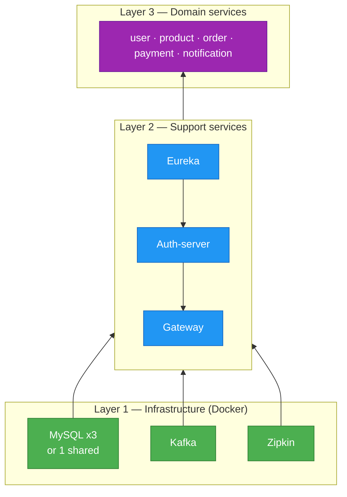

# Dependency stack

Bottom-up view: infrastructure feeds platform services, which feed
domain services. Each layer has to be healthy before the next can
start — Docker Compose enforces this via `depends_on` + healthchecks.

**Why bottom-up:**
- MySQL needs ~10s to accept connections — nothing above can start until
  it's healthy
- Eureka must exist before any Spring service, because they register
  with it at boot time
- Gateway needs auth-server's JWKS endpoint to validate incoming JWTs

**Shutdown is the reverse** — stop Layer 3 (apps) first so in-flight
requests can drain, then Layer 2, then Layer 1.

See the ASCII version in [`setup/01-startup-runbook.md`](../setup/01-startup-runbook.md#the-dependency-stack-for-this-project).
