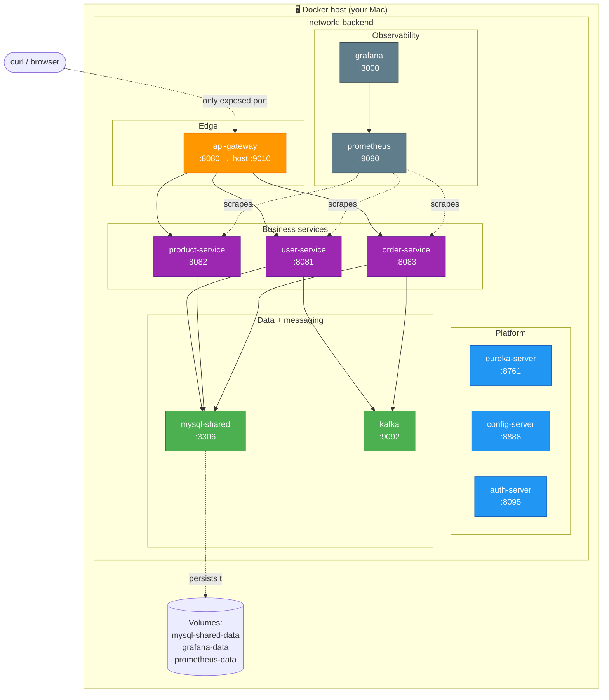

# Docker mental model

What's actually running when you `make up` (shared-db mode). All
containers share a bridge network called `backend`; only `api-gateway`
publishes a port to the Mac host. Data lives in named Docker volumes.

**Legend:**
- 🟠 Orange — edge (only container exposed to the outside world)
- 🔵 Blue — platform services (service discovery, config, auth)
- 🟣 Purple — business services (your domain code)
- 🟢 Green — data + messaging infrastructure
- ⚫ Grey — observability
- Dotted arrows — Prometheus scrapes, Grafana queries, MySQL writes to volume

See the ASCII version in [`setup/docker-howto.md`](../setup/docker-howto.md#1-mental-model--whats-actually-running).
