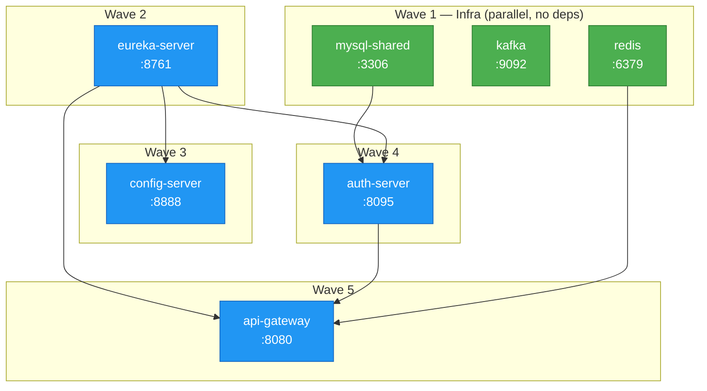

# Nano mode — startup order

5-wave dependency chain. Docker Compose waits for each wave's
healthchecks to pass before starting the next. End-to-end: ~45-60s
on a warm boot.

**Legend:**
- 🟢 Green — infrastructure containers (no deps between them, start in parallel)
- 🔵 Blue — Spring Boot services (each depends on an earlier wave)

See the ASCII version in [`setup/00-first-time-setup.md`](../setup/00-first-time-setup.md#startup-order-handled-by-depends_on-healthchecks).
