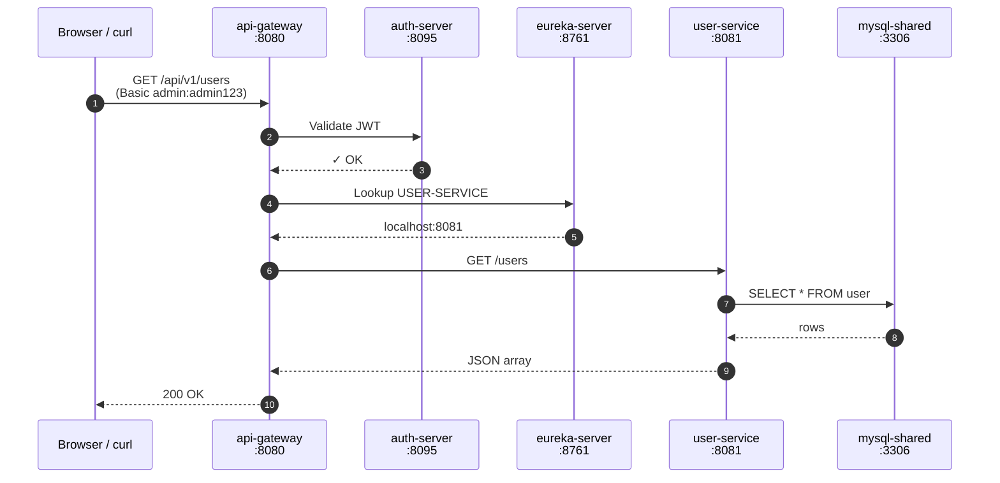

# Request flow — browser to service

Sequence diagram showing a single API call hopping through every
component. Example: `GET /api/v1/users` landing in `user-service`.

**Steps 1-3 — auth boundary:** gateway validates the Basic token
against auth-server; if the JWT is bad, request stops here with 401.

**Steps 4-5 — discovery:** gateway doesn't know *where* user-service
lives; it asks Eureka for an instance URL.

**Steps 6-10 — downstream:** gateway proxies the request. User-service
hits MySQL, returns JSON up the chain.

See the ASCII version in [`setup/00-first-time-setup.md`](../setup/00-first-time-setup.md#5-·-verify-the-service-registered).
