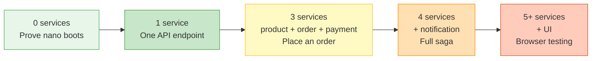

# Effort vs. capability ladder

How many business services you run depends on what you want to do.
This is the progression — each level unlocks more capability but
costs more RAM.

| Level | Services | Example command |
|---|---|---|
| 0 | — | `make up-nano` + `curl /actuator/health` |
| 1 | user **or** product | `make up-nano` + `make debug-user` |
| 3 | product + order + payment | `make up-nano` + `make debug-saga` |
| 4 | + notification | `make up-nano` + `make debug-all` |
| 5+ | + shop-ui / backoffice-ui | manual (UIs run on separate ports) |

Rule: run only what you need. Each extra Spring Boot service ≈ 400 MB RAM.

See the ASCII version in [`setup/00-first-time-setup.md`](../setup/00-first-time-setup.md#6-·-how-many-services-do-i-actually-need-to-run).
