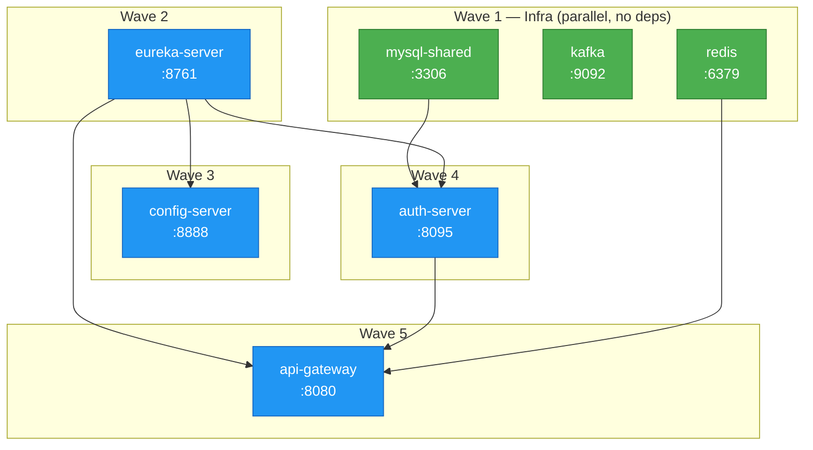
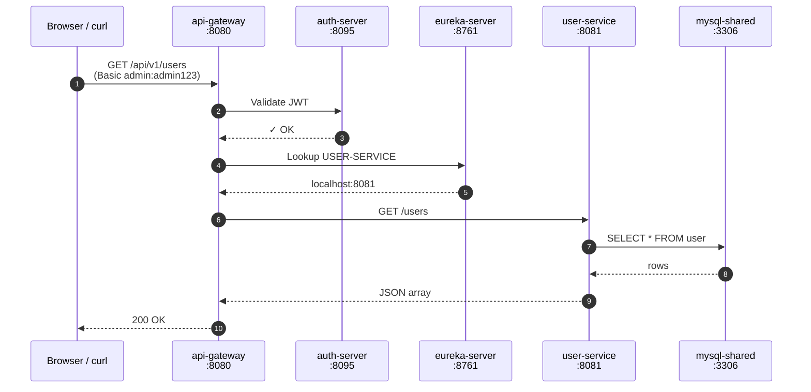
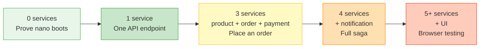

# First-time setup

First time running this project? Start here.

## What you're setting up

This is a Spring Boot microservices playground — a mini e-commerce
stack with user, product, order, and payment services talking to each
other through a gateway, Kafka, and MySQL. Everything runs in Docker
on your Mac, so you don't need to install databases or message brokers
yourself.

## What you'll have at the end

A working stack you can hit with `curl` — place an order, see it flow
through 4 services and a saga, land in the database. You'll also have
Grafana dashboards showing live metrics (if you pick the full mode).

## What this doc gets you

The shortest path from `git clone` to "the stack is running and I can
curl it." No deep explanations here — the architecture lives in
[`../00-architecture-overview.md`](../00-architecture-overview.md).

- Install the 2-4 tools you need (Docker, Git, optionally Java + Maven)
- Create a `.env` file for secrets
- Pick a mode (small/medium/full)
- Verify everything's healthy

## Contents

1. [Prereqs — install these once](#1-prereqs--install-these-once----required--one-time) — *Required · One-time*
2. [Clone and enter the repo](#2-clone-and-enter-the-repo----required--one-time) — *Required · One-time*
3. [Set up your `.env` file](#3-set-up-your-env-file----required) — *Required*
4. [Pick a mode and start the stack](#4-pick-a-mode-and-start-the-stack----required--pick-one) — *Required · pick one*
    - Option A — nano (lightest)
    - Option B — minimal (full stack in Docker)
    - Option C — hybrid (infra in Docker, apps on Mac)
5. [Verify it's working](#5-verify-its-working----required) — *Required*
6. [Run a sanity test](#6-run-a-sanity-test----optional--recommended) — *Optional · recommended*
7. [Stop everything when done](#7-stop-everything-when-done----optional) — *Optional*

- [Troubleshooting first-run failures](#troubleshooting-first-run-failures)
- [What's next](#whats-next)
- [Quick reference card](#quick-reference-card)
- [Option A deep dive — nano mode](#option-a-deep-dive--nano-mode)
    - [Why these 7 containers](#why-these-7-containers)
    - [Startup order (handled by `depends_on` healthchecks)](#startup-order-handled-by-depends_on-healthchecks)
    - [Verify each container is healthy](#verify-each-container-is-healthy)
    - [After nano is up — next steps](#after-nano-is-up--next-steps)
        - 1 · Confirm the platform is reachable
        - 2 · Pick which business service(s) to run
        - 3 · Run a service — via `mvn` (terminal)
        - 4 · Run a service — via IntelliJ IDEA
        - 5 · Verify the service registered
        - 6 · How many services do I actually need to run?
        - 7 · Multi-service workflow (full order flow)
        - 8 · Pitfalls
    - [Nano-specific troubleshooting](#nano-specific-troubleshooting)

---

## 1. Prereqs — install these once  — **Required · One-time**

Open Terminal and check each:

```bash
docker --version        # need Docker Desktop 4.0+ (Compose v2 built in)   Required
java --version          # need Java 17.x                                   Optional (only Option C)
mvn --version           # need Maven 3.8+                                  Optional (only Option C)
git --version           # ships with macOS, should Just Work               Required
```

**Docker + Git are the only MUST-HAVES for the pure-Docker modes
(Options A + B).** Java and Maven are needed ONLY if you plan to run
services on your host via Option C (hybrid). Skip them for now if
you're unsure.

If any are missing:

| Tool | Install with | When needed |
|---|---|---|
| Docker Desktop | https://www.docker.com/products/docker-desktop/ — install, open, let it start | Always |
| Git | `xcode-select --install` (usually preinstalled on macOS) | Always |
| Java 17 | `brew install openjdk@17` (then follow brew's post-install symlink notes) | Only Option C |
| Maven | `brew install maven` | Only Option C |

### Docker Desktop — set memory to at least 8 GB — **Required**

Open Docker Desktop → Settings → Resources:

```
Memory:  8 GB    (minimum — 10-12 GB is better if you have the RAM)
CPUs:    5       (minimum)
Disk:    60 GB
```

Click **Apply & Restart**. If you give Docker less than 8 GB, the
shared-db mode will OOM-kill containers.

> **For nano mode only (Option A), 4 GB is enough.** But 8 GB is the
> safe default for all modes.

---

## 2. Clone and enter the repo  — **Required · One-time**

```bash
git clone git@github.com:bhanuonline/my-microservices.git
cd my-microservices
```

(If you're reading this, you've probably already done that.)

---

## 3. Set up your `.env` file  — **Required**

The project uses a `.env` file for secrets (passwords, tokens). It's
gitignored — you create it from a template:

```bash
cp .env.example .env
```

Open `.env` in any editor and set these two to any value you want.
Compose refuses to start if they're blank:

```bash
MYSQL_ROOT_PASSWORD=changeme       # Required. Any string. MySQL root password.
GF_ADMIN_PASSWORD=admin            # Required. Any string. Grafana admin login.
                                   # (Still required even in nano mode — the
                                   #  Grafana block is defined in the base
                                   #  compose file, so compose validates it.)
```

Every other variable in `.env.example` has a sensible default in
`docker-compose.yml` — you can leave them blank or as-is unless you
want that specific feature:

- `DB_USERNAME`, `DB_PASSWORD` — defaults to `root` / `pass1234`
- `VAULT_DEV_ROOT_TOKEN` — only matters in `full` mode
- `STRIPE_*`, `RAZORPAY_*`, `PAYPAL_*`, `CHECKOUTCOM_*` — only if you
  want to test that payment provider

Save and close.

---

## 4. Pick a mode and start the stack  — **Required · pick one**

Three ways to run. Each trades off RAM + feature coverage differently.
Pick ONE based on what you want to do.

### Quick comparison

| | **Option A — nano** | **Option B — minimal** | **Option C — hybrid** |
|---|---|---|---|
| **Command** | `make up-nano` | `make up-minimal` | `./start-stack.sh` |
| **Containers** | 7 | 13 | 3 (infra) + apps on host |
| **RAM** | ~1.6 GB | ~2.6 GB | ~1.5 GB Docker + ~2 GB host |
| **First-run time** | 5-8 min | 5-10 min | 5-10 min |
| **Later runs** | ~30-45 s | ~45-60 s | ~1-2 min |
| **Business services** | ❌ off | ✓ in Docker | ✓ on your Mac |
| **Can hit `/api/v1/*` endpoints** | ❌ no | ✓ yes | ✓ yes |
| **Grafana + Prometheus** | ❌ no | ✓ yes | ✓ yes |
| **IDE debugging / breakpoints** | ❌ no | ❌ no | ✓ yes |
| **Fast code-rebuild cycle** | — | ❌ needs image rebuild | ✓ `mvn` + rerun |
| **Needs Java 17 + Maven on host** | ❌ no | ❌ no | ✓ yes |

### What each option is for

| Option | Pick this when… | Good as a first run? |
|---|---|---|
| **A — nano** | You want to prove the stack boots cleanly before investing time. Smallest footprint. | ✓ **Recommended first-time** |
| **B — minimal** | You want to curl business APIs end-to-end without opening an IDE. | ✓ Also good |
| **C — hybrid** | You're actively editing Java code and want IDE breakpoints + fast re-runs. | ✗ Skip until you need it |

### If still unsure

Pick **A (nano)** first. If it boots cleanly, you've proven:
- Docker Desktop has enough RAM
- Your ports (3306, 8080, etc.) are free
- Your `.env` is set up right
- The images build successfully

Then upgrade to B with `make down && make up-minimal` — 2 extra
minutes and you've got the full stack.

---

### Option A — nano  (lightest)

7 containers, ~1.6 GB RAM. Just the platform floor — no business
services yet.

```bash
make up-nano
```

**What runs:** `mysql-shared`, `kafka`, `redis`, `eureka-server`,
`config-server`, `auth-server`, `api-gateway`.

**What does NOT run:** the 4 business services (user, product, order,
payment), Prometheus/Grafana, Zipkin, notification, resource-server.
`curl /api/v1/users` will return 503 — expected.

**You can run a business service from your IDE** (connects to this
Docker-hosted platform).

→ **[Deep dive on nano mode](#option-a-deep-dive--nano-mode)** —
why these 7, startup order diagram, next steps, nano-specific troubleshooting.

---

### Option B — minimal  (full stack in Docker)

13 containers, ~2.6 GB RAM. Everything in nano PLUS the 4 business
services and observability (Prometheus + Grafana).

```bash
make up-minimal
```

**What runs:** everything in nano + `user-service` (8081),
`product-service` (8082), `order-service` (8083),
`payment-service` (8091), `prometheus` (9090), `grafana` (3000).

**What does NOT run:** notification, resource-server, zipkin, kafka-ui,
elasticsearch, vault, etc. — those live behind other mode profiles
(see [`topologies.md`](topologies.md)).

---

### Option C — hybrid  (infra in Docker, apps on your Mac)

Infra containers run in Docker (fast + stable). Business services run
as `java -jar` on your host (fast rebuild, IDE breakpoints, debugger
attach).

```bash
./start-stack.sh    # auto-detects first run → full bootstrap
                    # (builds all jars, pulls images, starts everything)
```

**Needs:** JDK 17 + Maven installed on your Mac (see Step 1).

See [`docker-howto.md`](docker-howto.md) section 0 for when to pick
which. For now, if you're not sure, pick A or B.

---

## 5. Verify it's working  — **Required**

Wait ~60-90 seconds after step 4 finishes (Spring Boot services need
time to register with Eureka). Then:

```bash
docker compose ps                    # should show containers "Up (healthy)"
```

Open these in your browser (adjust by which Option you picked):

| URL | Option A (nano) | Option B (minimal) | Option C (hybrid) |
|---|:---:|:---:|:---:|
| http://localhost:8761 — Eureka | ✓ | ✓ | ✓ |
| http://localhost:8080/actuator/health — Gateway | ✓ | ✓ | ✓ |
| http://localhost:3000 — Grafana | — | ✓ | ✓ |
| http://localhost:9090 — Prometheus | — | ✓ | ✓ |

If any of these fail, see [troubleshooting](#troubleshooting-first-run-failures) below.

---

## 6. Run a sanity test  — **Optional · recommended**

Not strictly required — step 5 already proved the stack is healthy.
This step just confirms end-to-end request flow works.

### If you picked Option A (nano) — gateway + eureka only

```bash
# Gateway health JSON
curl -s http://localhost:8080/actuator/health

# Eureka — list of registered apps (should show at least api-gateway + config-server)
curl -s http://localhost:8761/eureka/apps | grep -oE '<name>[^<]+' | sort -u
```

Expected: gateway returns `{"status":"UP",...}`. Eureka shows 2
`<name>…` entries. Nano doesn't include business services, so there's
no product endpoint to hit yet — add one from your IDE (see
[`topologies.md`](topologies.md) "Mode: nano — Typical workflow").

### If you picked Option B (minimal) — fetch a product

```bash
curl -u admin:admin123 http://localhost:8080/api/v1/products
```

Should return a JSON array of products (empty `[]` is fine on first run —
means the API works, no products inserted yet).

If you get `Connection refused`: wait 30 more seconds for services to
finish starting, then retry.

---

## 7. Stop everything when done  — **Optional**

Run only when you're done for the day. Containers can stay running
across sessions without issue; data persists in Docker volumes.

```bash
make down                 # if you used Option A
./stop-stack.sh           # if you used Option B
```

Data stays in Docker volumes between runs. To wipe data clean (fresh
start):

```bash
docker compose down -v    # removes volumes = DELETES all DB data
```

---

## Troubleshooting first-run failures

### "set MYSQL_ROOT_PASSWORD in .env"
You skipped step 3, or your `.env` has a blank value. Open `.env`, set
`MYSQL_ROOT_PASSWORD` to any string, save.

### Container exits immediately
Check its log:
```bash
docker compose logs <container-name>
```
Most common cause: a required env var isn't set. The compose file uses
`${VAR:?set VAR in .env}` syntax so missing values fail fast with a
clear message.

### "Cannot connect to Docker daemon"
Docker Desktop isn't running. Open it from Applications. Wait for the
whale icon in the top bar to stop animating.

### Grafana login fails
Default `admin/admin` was changed in step 3. Use what you put in
`GF_ADMIN_PASSWORD`. If forgotten, re-edit `.env` and run `make down &&
make up-minimal`.

### Port already in use (e.g. `3306`)
Something else on your Mac is already using that port (common for
MySQL). Stop it:
```bash
lsof -i :3306                          # find what's using it
brew services stop mysql               # if Homebrew mysql is running
```

### Everything looks healthy but APIs return 401
You're missing the `-u admin:admin123` in curl. Every API through the
gateway needs HTTP Basic auth in dev mode.

### Build takes forever
Normal on first run: 2 GB image downloads + full mvn package. Subsequent
runs skip both — ~30s to start.

### Still stuck
Check [`troubleshooting.md`](../debug/troubleshooting.md) and
[`setup-error.md`](setup-error.md) for known errors.

---

## What's next

Now that it's running:

- [`00-architecture-overview.md`](../00-architecture-overview.md) — 5-min overview of the system
- [`docker-howto.md`](docker-howto.md) — day-to-day Docker commands for this repo
- [`topologies.md`](topologies.md) — all the modes you can run (`make up-saga`, `--trace`, etc.)
- [`02-verification-checklist.md`](02-verification-checklist.md) — full "is it healthy?" curl checklist
- [`debugging-flows.md`](../debug/debugging-flows.md) — Postman collections for walking a saga step-by-step
- [`concepts/`](concepts/) — the patterns you'll see across the code

---

## Quick reference card

### Lifecycle — Pure-Docker mode

Driven by the [`Makefile`](../../../Makefile).

```bash
make up-nano              # start, platform only (7 containers, biz svcs OFF)
make up-nano-trace        # nano + zipkin for distributed traces (8 containers)
make up-minimal           # start, platform + biz svcs (12 containers)
make up                   # start, everything (26 containers)
make down                 # stop
make logs                 # tail everything
make logs-user-service    # tail one service
make stats                # live CPU/MEM usage
make ps                   # what's running
```

### Health check

Script: [`scripts/verify-stack.sh`](../../../scripts/verify-stack.sh)

```bash
make verify               # compose ps + stats + infra probes + HTTP + Eureka
```

### MySQL shell

Script: [`scripts/mysql.sh`](../../../scripts/mysql.sh) · password pulled from `.env`

```bash
make mysql                # root prompt, no schema
make mysql-user           # into userdb
make mysql-product        # into productdb
make mysql-auth           # into authdb
make mysql-payment        # into paymentdb
```

### Redis shell

Script: [`scripts/redis.sh`](../../../scripts/redis.sh) · no password (dev only)

```bash
make redis                # redis-cli interactive prompt
make redis-info           # INFO (version/memory/clients)
make redis-keys           # list ALL keys
make redis-flush          # wipe all data (confirms first)
```

### Kafka CLI

Script: [`scripts/kafka.sh`](../../../scripts/kafka.sh) · hides the long `docker exec …` prefix

```bash
make kafka-topics                                  # list topics
make kafka-describe TOPIC=order.created            # one topic
make kafka-consume  TOPIC=order.created            # tail live
make kafka-consume  TOPIC=order.created FROM_BEGINNING=1
make kafka-groups                                  # list consumer groups
make kafka-group-describe GROUP=order-saga         # group lag
make kafka-shell                                   # shell into container
```

### Kafka UI (browser)   http://localhost:8090

```bash
COMPOSE_PROFILES=cache,kafka-ops docker compose up -d kafka-ui
```

### Run a service with debugger attached (one at a time, foreground)

Script: [`scripts/run-service.sh`](../../../scripts/run-service.sh) · unique debug port per service

Each `make debug-*` call **blocks its terminal** showing the service's live
log output. Open one terminal per service. Stop with `Ctrl+C`.

```bash
make debug-user              # :8081 app, :5005 debugger
make debug-product           # :8082 app, :5006 debugger
make debug-order             # :8083 app, :5007 debugger
make debug-payment           # :8091 app, :5008 debugger
make debug-notification      # :8099 app, :5009 debugger
make debug-list              # all services + debug ports
```

### Multi-service debug (background, one terminal)

For when you need several services at once but don't want to juggle
terminals. Each service goes to `logs/<service>-debug.log`. Debug ports
unchanged — attach IntelliJ to any one. Stop all with `make debug-stop`.

```bash
make debug-saga        # product + order + payment       (3 services)
make debug-core        # + user                           (4 services)
make debug-all         # + notification                   (5 services)
make debug-stop        # stops every background debug JVM

# Follow a specific service's log
tail -f logs/order-service-debug.log

# Or watch all interleaved
tail -f logs/*-debug.log
```

Pick `debug-saga` for order-flow debugging, `debug-all` for full saga
including `NOTIFIED` state.

### Hybrid mode (infra in Docker, apps on host)

Scripts: [`start-stack.sh`](../../../start-stack.sh) · [`stop-stack.sh`](../../../stop-stack.sh)

```bash
./start-stack.sh                        # auto-detect + run
./start-stack.sh --minimal              # explicit minimal
./start-stack.sh user-service           # one service + its deps
./start-stack.sh --status               # what's running
./stop-stack.sh                         # stop
./stop-stack.sh --apps-only             # stop apps, keep infra
```

### Docker directly (no wrapper)

If you'd rather skip `make` / scripts, these are the raw equivalents:

```bash
docker compose ps                       # list containers
docker compose logs -f <service>        # tail one service
docker compose exec <service> sh        # shell inside a container
docker stats                            # live resource usage
```

---

## Option A deep dive — nano mode

Linked from Step 4 Option A. Read this if you want to understand WHY
these 7 containers, HOW they start up, and WHAT to do once they're up.

### Why these 7 containers

Each container earns its spot — remove any one and the stack won't start.

| Container | Port | Why it's in nano |
|---|---|---|
| `mysql-shared` | 3306 | Holds 4 schemas (userdb, productdb, authdb, paymentdb). Needed by auth-server at boot (JDBC password hash lookup) and by any business service you later run from your IDE. |
| `kafka` | 9092 | Event bus for sagas + outbox pattern. Pre-started so services you add later don't have to wait for broker boot. |
| `redis` | 6379 | **Required by api-gateway.** Backs the rate-limiter, API-key store, idempotency store, and response cache. Gateway refuses to start without it. |
| `eureka-server` | 8761 | Service discovery. Every other service registers here on boot; without it, nothing can find anything. |
| `config-server` | 8888 | Serves YAML config files to every other service. Services ask for `http://config-server:8888/<service-name>/<profile>`. Mounted from `config-repo/` in the repo. |
| `auth-server` | 8095 | OAuth2 token issuer. Gateway verifies incoming JWTs via its `/oauth2/jwks` endpoint. Also owns the user authentication flow. |
| `api-gateway` | 8080 | Reactive gateway. Only service with a port the outside world (your browser/curl) talks to. Routes based on Eureka lookups. |

### Startup order (handled by `depends_on` healthchecks)



Compose waits for each container's healthcheck to pass before starting
the next wave. End-to-end: ~45-60 seconds on a warm boot.

### Verify each container is healthy

**Shortcut — one command runs all the checks:**

```bash
make verify
```

Runs [`scripts/verify-stack.sh`](../../../scripts/verify-stack.sh)
which prints a colored pass/fail report of containers up, RAM budget,
MySQL/Kafka/Redis probes, Spring Boot health endpoints, and Eureka
registration. Exit code 0 = all green, 1 = something failed.

If you want to understand WHAT it's checking (or need to debug a
specific layer), run the individual commands below:

**1. Are all 7 containers up?**

```bash
docker compose ps
```

Expected: 7 rows, each `STATUS` showing `Up X seconds (healthy)` or
just `Up X seconds` (api-gateway doesn't have a healthcheck configured;
`Up` is enough).

**2. Live resource usage (RAM budget check)**

```bash
docker stats --no-stream
```

Expected: total memory in use ~1.6 GB across all 7 containers. If any
single container is at 95%+ of its limit, see troubleshooting.

**3. Infra health — MySQL, Kafka, Redis**

```bash
# MySQL — list schemas (uses ./scripts/mysql.sh under the hood)
make mysql -- -e "SHOW DATABASES;"
# OR directly:  ./scripts/mysql.sh "" -e "SHOW DATABASES;"

# Kafka — broker responds to API-versions query
docker exec kafka kafka-broker-api-versions.sh --bootstrap-server localhost:9092 2>&1 | head -3

# Redis — PONG
docker exec redis redis-cli ping
```

Expected:
- MySQL: 4 schema names printed (userdb, productdb, authdb, paymentdb)
- Kafka: version numbers list (not an error)
- Redis: `PONG`

> **Tip — MySQL shell:** use
> [`scripts/mysql.sh`](../../../scripts/mysql.sh) — password is pulled
> from `.env` automatically:
>
> ```bash
> make mysql              # root prompt, no schema
> make mysql-user         # into userdb
> make mysql-product      # into productdb
> make mysql-auth         # into authdb
> make mysql-payment      # into paymentdb
> ```
>
> **Tip — Redis shell:** use
> [`scripts/redis.sh`](../../../scripts/redis.sh) — no password (dev-only):
>
> ```bash
> make redis              # redis-cli interactive prompt
> make redis-info         # INFO (version, memory, clients, …)
> make redis-keys         # list ALL keys (don't do this in prod)
> make redis-flush        # wipe all data (with confirmation)
> ```
>
> **Tip — Kafka CLI:** use
> [`scripts/kafka.sh`](../../../scripts/kafka.sh) — hides the long
> `docker exec kafka kafka-X.sh --bootstrap-server ...` prefix:
>
> ```bash
> make kafka-topics                            # list all topics
> make kafka-describe TOPIC=order.created      # one topic's partitions
> make kafka-consume  TOPIC=order.created      # tail live messages
> make kafka-consume  TOPIC=order.created FROM_BEGINNING=1
> make kafka-groups                            # list consumer groups
> make kafka-group-describe GROUP=order-saga   # group members + lag
> ```
>
> For anything exotic: `./scripts/kafka.sh --help`.
>
> **Tip — Kafka GUI (browser UI):** the project already includes
> [Provectus Kafka UI](https://github.com/provectus/kafka-ui) behind
> the `kafka-ops` profile. Start it on top of what you have:
>
> ```bash
> COMPOSE_PROFILES=cache,kafka-ops docker compose up -d kafka-ui
> open http://localhost:8090
> ```
>
> What you get at http://localhost:8090:
> - **Topics** — browse messages (JSON view), produce from the browser,
>   see per-partition offsets.
> - **Consumer Groups** — live lag per partition (critical for saga
>   debugging), reset offsets with a click.
> - **Brokers** — broker metadata + config.
>
> No login required (dev mode). ~384 MB extra RAM. To include it
> automatically, use `make up-kafka-debug` instead of `make up-nano`.

**4. Spring Boot services — HTTP health probes**

```bash
echo "=== eureka  ===" ; curl -s http://localhost:8761/actuator/health; echo
echo "=== config  ===" ; curl -s http://localhost:8888/actuator/health; echo
echo "=== auth    ===" ; curl -s http://localhost:8095/actuator/health; echo
echo "=== gateway ===" ; curl -s http://localhost:8080/actuator/health; echo
```

Expected: each returns `{"status":"UP"...}`. If auth-server or gateway
return `DOWN`, it usually means a dependency (MySQL / Redis) isn't
reachable from inside the container.

**5. Eureka registration — are services visible to each other?**

```bash
curl -s http://localhost:8761/eureka/apps | grep -oE '<name>[^<]+' | sort -u
```

Expected: at least `<name>API-GATEWAY` and `<name>CONFIG-SERVER`.
auth-server appears a few seconds after the others. If any are missing
after 1 minute, that service hasn't registered — check its logs:
`docker compose logs --tail 30 <service>`.

### After nano is up — next steps

Nano gives you the platform. To hit `/api/v1/*` endpoints or exercise
a saga, you need to run at least one business service alongside it.
This section walks through how.

#### 1 · Confirm the platform is reachable

**Eureka dashboard** — http://localhost:8761 should list 2 services:
`API-GATEWAY` and `CONFIG-SERVER` (auth-server joins lazily, refresh
after ~10s).

**Gateway health** — JSON including `"status":"UP"` and components for
`redis`, `eureka`, `r2dbc`:

```bash
curl -s http://localhost:8080/actuator/health | head -c 400
```

#### 2 · Pick which business service(s) to run

| Service | Port | Depends on | What you need it for |
|---|---|---|---|
| `user-service` | 8081 | auth-server, mysql, kafka, config-server | `/api/v1/users` CRUD, user registration saga |
| `product-service` | 8082 | mysql, kafka, config-server | `/api/v1/products`, inventory check |
| `order-service` | 8083 | mysql, kafka, config-server, product-service | `/checkout`, order creation + saga orchestrator |
| `payment-service` | 8091 | mysql, kafka, config-server | Payment providers (Mock, Stripe, Razorpay, PayPal, Checkout.com) |
| `notification` | 8099 | kafka, config-server | Saga notify step (needed if you want `NOTIFIED` state) |

**Quick picks:**
- **Just want product CRUD?** → `product-service`
- **Full order flow?** → `product-service` + `order-service` + `payment-service`
- **End-to-end saga (user registered → emails sent)?** → add `notification` too

#### 3 · Run a service — via `mvn` (terminal)

Pin Java 17 first (project is Java 17; your shell may default to another):

```bash
export JAVA_HOME=$(/usr/libexec/java_home -v 17)
export PATH=$JAVA_HOME/bin:$PATH
java --version      # verify: openjdk 17.x
```

**Normal start:**

```bash
cd /Users/bhanupratap/My/my-microservices
mvn -pl services/user-service -am spring-boot:run
```

- `-pl services/user-service` — build only this one module
- `-am` — also build its dependencies (common-lib, etc.)

**With a Spring profile:**

```bash
mvn -pl services/user-service -am spring-boot:run \
    -Dspring-boot.run.profiles=dev
```

Profiles common in this project:
- `docker` — points at `mysql-shared:3306`, `kafka:29092` (container
  hostnames). Only use when running INSIDE Docker.
- `dev` — host-side defaults (`localhost:3306`, `localhost:9092`).
  Pick this when running via `mvn` on your Mac. Often implicit via
  `application.yml` defaults.
- `test` — in-memory H2 + embedded Kafka. For running unit tests.
- Multiple at once: `-Dspring-boot.run.profiles=dev,canary`

**With debugger attached (JVM remote debug):**

Two ways — pick either:

**Option 1 — shortcut (recommended):**

[`scripts/run-service.sh`](../../../scripts/run-service.sh) pins Java
17, picks a unique debug port per service, and sets sensible JDWP
defaults. Wrapped by `make debug-<service>`:

```bash
make debug-user           # port :8081, debugger on :5005
make debug-product        # port :8082, debugger on :5006
make debug-order          # port :8083, debugger on :5007
make debug-payment        # port :8091, debugger on :5008
make debug-notification   # port :8099, debugger on :5009
make debug-list           # see full list + ports

# Override the Spring profile:
make debug-user PROFILE=dev,canary

# Or call the script directly for finer control:
./scripts/run-service.sh user dev           # default
./scripts/run-service.sh user dev --suspend # JVM pauses until debugger attaches
```

**Option 2 — raw mvn (if you want full control):**

```bash
mvn -pl services/user-service -am spring-boot:run \
    -Dspring-boot.run.jvmArguments="-agentlib:jdwp=transport=dt_socket,server=y,suspend=n,address=*:5005"
```

- `server=y` — JVM waits for debugger to attach
- `suspend=n` — don't block startup; service runs normally even if no
  debugger connects (use `suspend=y` to pause until you attach)
- `address=*:5005` — port 5005 for IntelliJ/VSCode to connect to

Pick a different port per service to debug multiple at once:
`user-service: 5005`, `product-service: 5006`, `order-service: 5007`,
`payment-service: 5008`, `notification: 5009`.

**Attach from IntelliJ** (same for both options):
**Run → Edit Configurations → + → Remote JVM Debug** → host
`localhost`, port = whichever one above matches your service → click
Debug.

Running multiple services with debug? Each gets its own port, so no
conflicts. Create one Remote JVM Debug config per service.

**With extra JVM options (heap, GC, system properties):**

```bash
mvn -pl services/user-service -am spring-boot:run \
    -Dspring-boot.run.jvmArguments="-Xms256m -Xmx512m -Dcustom.flag=true"
```

**Override a config value from command line:**

```bash
mvn -pl services/user-service -am spring-boot:run \
    -Dspring-boot.run.arguments="--server.port=9999 --spring.datasource.url=jdbc:h2:mem:test"
```

Watch the output. You'll see Spring Boot startup, then:
```
Started UserServiceApplication in 23.456 seconds
Registered with eureka ... status: 204
```

Terminal is now blocked by the running service. Open a new terminal
for anything else. Stop it with Ctrl+C.

#### 4 · Run a service — via IntelliJ IDEA

**One-time setup:**

1. **File → Open** → point at `/Users/bhanupratap/My/my-microservices`
2. Wait for IntelliJ to import the Maven project (~1 min)
3. **File → Project Structure → Project SDK → Java 17**
4. Open the service's `pom.xml` → right-click → **Add as Maven Project**

**Run the service:**

1. Find the `*Application.java` class, e.g.
   `services/user-service/src/main/java/.../UserServiceApplication.java`
2. Click the ▶ green arrow next to `public static void main(...)`
3. First run creates a Run Configuration automatically

**Set a Spring profile for the Run Configuration:**

1. **Run → Edit Configurations…**
2. Pick your service's config in the left list
3. **Environment variables** → add:
   ```
   SPRING_PROFILES_ACTIVE=dev
   ```
   (or `docker`, `test`, or comma-separated: `dev,canary`)
4. Save. The profile applies next time you Run or Debug.

**Alternatively** — add to **VM options**:
```
-Dspring.profiles.active=dev
```

**Attach the debugger (local — simpler):**

- Set breakpoints by clicking in the gutter (left of line numbers)
- Instead of ▶ Run, click 🐞 **Debug** on the same Run Configuration
- Make a request through the gateway — IntelliJ stops at your breakpoint
- Step through, inspect variables, change values, resume
- Hot-swap works: edit a method body, `⌘F9` to recompile, hits with
  new code without restart

**Attach the debugger (remote — when service is run via mvn):**

Use this when you started the service with the `-agentlib:jdwp...`
flag shown in section 3.

1. **Run → Edit Configurations… → + → Remote JVM Debug**
2. Host `localhost`, Port `5005` (or whatever port you used)
3. Name it `Debug user-service remote` (or similar)
4. Click 🐞 **Debug**
5. Hit a breakpoint — IntelliJ shows the running JVM's stack

Difference:
- Local debug = IDE owns the JVM. Fastest, hot-swap works.
- Remote debug = IDE attaches to an already-running JVM (started by
  mvn or Docker). Needed when you can't launch from IDE directly
  (e.g. the service runs inside a container).

**Fast rebuild loop** — IntelliJ's auto-build on save means code
changes recompile instantly. Hit `Ctrl+F9` (⌘F9 on Mac) to rebuild
+ hot-swap into the running JVM for most edits (methods, not class
structure).

#### 5 · Verify the service registered

```bash
# Does Eureka know about it?
curl -s http://localhost:8761/eureka/apps | grep -oE '<name>[^<]+' | sort -u
# Expected: your service name now shows up (e.g. USER-SERVICE)

# Can the gateway route to it?
curl -u admin:admin123 http://localhost:8080/api/v1/users
# Expected: 200 OK with JSON (empty [] is fine)

# Or hit the service directly, bypassing gateway:
curl -s http://localhost:8081/actuator/health
# Expected: {"status":"UP"}
```

Flow for an API call:



#### 6 · How many services do I actually need to run?

Short answer: **start with 0, add one at a time, only run what you need
for the thing you're trying to do.** Running everything "just in case"
wastes RAM and makes logs noisy.

**Pick by what you want to do:**

| What you want to do | Services needed | Count | Why |
|---|---|---|---|
| Prove nano works | None | 0 | Nano already gives you gateway + eureka + mysql. Just curl their `/actuator/health`. |
| Edit one service in your IDE | That one service | 1 | e.g. editing `UserController.java` → run `user-service`. |
| Call `/api/v1/users` | `user-service` | 1 | Gateway routes to it. |
| Call `/api/v1/products` | `product-service` | 1 | Same, for products. |
| Place an order (`/checkout`) | product + order + payment | 3 | Order calls product to check stock, then payment for the saga. |
| Full saga incl. notifications | + `notification` | 4 | Needed to reach the `NOTIFIED` state. |
| Browser UI (shop or admin) | + `shop-ui` or `backoffice-ui` | 5+ | Browser-facing frontends. |

**Visual guide — effort climbs as capability grows:**



More services = more capability, but also more RAM and more terminal
tabs (unless you use `make debug-saga` / `-all` which run them in the
background).

**Recommended path for first-time learners:**

```
Day 1  →  make up-nano + make debug-user
          Play with the user API, Eureka dashboard, OAuth2 tokens.
          Set a breakpoint. Understand how a request flows.

Day 2  →  Keep nano. Add `make debug-product` in a 3rd terminal.
          Try  curl -u admin:admin123 http://localhost:8080/api/v1/products

Day 3  →  Add `make debug-order` (or just use `make debug-saga` to get
          product + order + payment all at once).
          Try  POST /checkout.
          Watch the saga events in Kafka UI (http://localhost:8090)
          or via `make kafka-consume TOPIC=order.events`.

Day 4  →  `make debug-all` — adds notification. Full saga.
          Trace an order through all 4 services.
```

**Rule of thumb:**

- **New to the project?** → 1 service at a time, foreground (`make debug-user`).
- **Testing a specific flow?** → Use a group shortcut (`make debug-saga` for order flow).
- **Running everything?** → `make debug-all` + Kafka UI + Grafana.

Don't start services you don't need. Each is ~400 MB RAM and your laptop
has limits.

---

#### 7 · Multi-service workflow (full order flow)

Open 4 terminal tabs/windows. Each runs one service.

**Terminal 1 — product-service (no dependencies on others):**
```bash
export JAVA_HOME=$(/usr/libexec/java_home -v 17); export PATH=$JAVA_HOME/bin:$PATH
mvn -pl services/product-service -am spring-boot:run
```

**Terminal 2 — order-service (needs product-service running):**
```bash
export JAVA_HOME=$(/usr/libexec/java_home -v 17); export PATH=$JAVA_HOME/bin:$PATH
mvn -pl services/order-service -am spring-boot:run
```

**Terminal 3 — payment-service:**
```bash
export JAVA_HOME=$(/usr/libexec/java_home -v 17); export PATH=$JAVA_HOME/bin:$PATH
mvn -pl services/payment-service -am spring-boot:run
```

**Terminal 4 — notification (optional, for the NOTIFIED saga state):**
```bash
export JAVA_HOME=$(/usr/libexec/java_home -v 17); export PATH=$JAVA_HOME/bin:$PATH
mvn -pl services/notification -am spring-boot:run
```

Wait ~30 seconds per service to boot. Then verify:

```bash
make verify            # health check all + Eureka registrations
```

Trigger the order flow:
```bash
curl -u admin:admin123 -X POST http://localhost:8080/checkout \
  -H "Content-Type: application/json" \
  -d '{"userId":1,"productIds":[1,2],"paymentProvider":"mock"}'
```

Watch the saga progress in `make kafka-consume TOPIC=order.events FROM_BEGINNING=1`.

#### 8 · Pitfalls

| Symptom | Cause | Fix |
|---|---|---|
| `BUILD FAILURE ... release version 17 not supported` | Shell is on Java 11 or 8 | `export JAVA_HOME=$(/usr/libexec/java_home -v 17)` before `mvn` |
| `Port 8081 already in use` | Service already running (from Docker or previous mvn) | `lsof -i :8081` then `kill PID`. OR check `docker compose ps` for a running container with that port. |
| Service starts but doesn't show in Eureka | Wrong Eureka URL (e.g. `eureka-server` doesn't resolve from host) | Service's `application.yml` should have `defaultZone: http://localhost:8761/eureka/` as fallback. Spring profile `docker` points at `eureka-server:8761` which only works inside containers. |
| `Failed to configure a DataSource` | MySQL not reachable | Check nano is running: `docker compose ps mysql-shared`. Then `make verify` for MySQL probe. |
| Gateway returns 503 for your service | Service didn't finish starting yet | Wait 10 more seconds, retry. Gateway's Eureka cache refreshes every ~30s. |
| 401 Unauthorized on all `/api/v1/*` calls | Missing `-u admin:admin123` | Dev mode uses HTTP Basic. Add the `-u` flag. |

For deeper issues, see [`../debug/troubleshooting.md`](../debug/troubleshooting.md).

### Nano-specific troubleshooting

| Symptom | Likely cause | Fix |
|---|---|---|
| `Ports are not available: :3306` | Homebrew MySQL already running | `brew services stop mysql` |
| `api-gateway` keeps restarting | Redis didn't start or isn't healthy | `docker compose logs redis` then `docker compose restart redis api-gateway` |
| `auth-server` exits with "Public Key Retrieval is not allowed" | MySQL JDBC URL missing `allowPublicKeyRetrieval=true` | Should be fixed in current compose. Check `docker-compose.yml` line for `AUTH_DB_URL` |
| `MYSQL_ROOT_PASSWORD` error on `make up-nano` | `.env` missing or value blank | Step 3 of this doc |
| Everything "Up" but gateway returns 503 | Business service not running (expected — nano has none) | Run one via IDE or `mvn spring-boot:run` |
| Lots of DNS errors in gateway logs mentioning `zipkin` | Tracing accidentally enabled | Shouldn't happen with current compose (`TRACING_ENABLED=false` default). If it does: `docker compose up -d --force-recreate api-gateway` |

For non-nano-specific issues, see [`../debug/troubleshooting.md`](../debug/troubleshooting.md).
