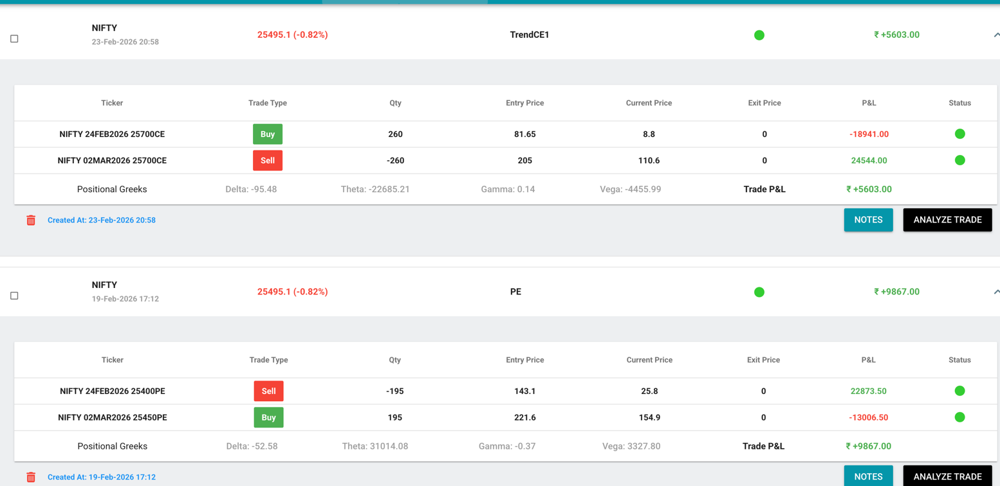
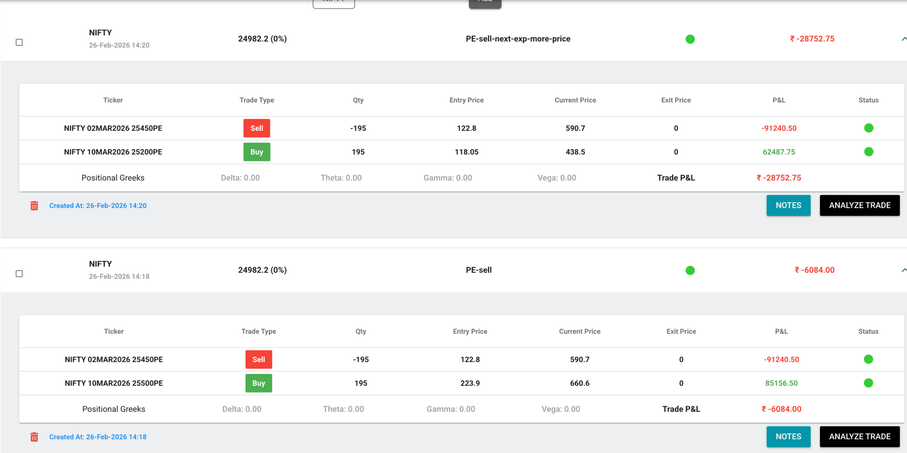
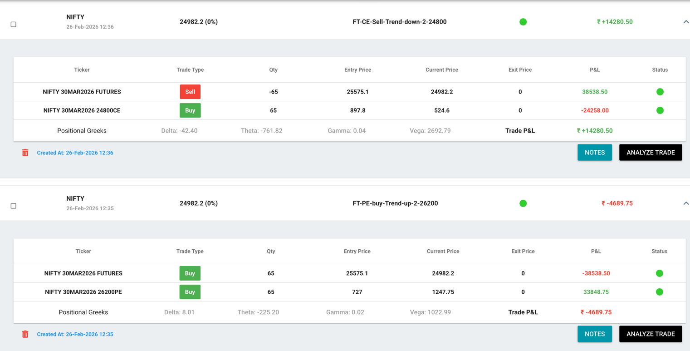
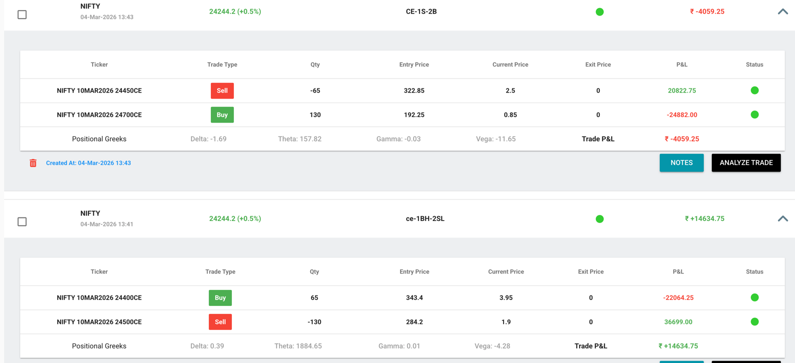

5600 feb : fail

Time > 9:15 Am
O:25940.90
H:25956.15
L:25878
C:25943.23

Time > 9:15 Am to 10:15
O:25940.90
H:25956.15
L:25878
C:25943.23

HA candle > normal close : PE down-sell
HA candle < normal close : CE long

### opening gap test 
day         [Normal candle]            [HA candle]        isGrater N>H       Expeted Gap   Test
31-dec-25        26129.50               26064.40                no             CE buy
1-jan-25         26146.55               25157.70         

