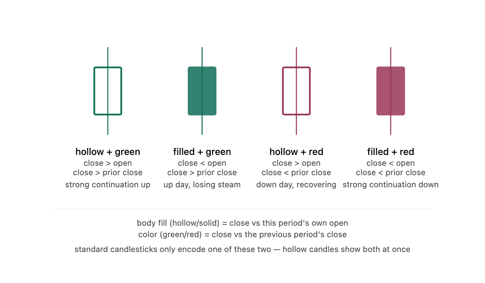


# Hollow Candles in Trading

## What is a Hollow Candle?

A Hollow Candle is a type of candlestick chart that provides more information than a traditional candlestick. It shows:

1. Whether buyers or sellers controlled the current trading session (Open vs Close).
2. Whether today's closing price is higher or lower than the previous day's closing price.

This helps traders better understand trend strength and market momentum.

---

# How Hollow Candles Work

Hollow Candles use **two comparisons**:

### 1. Open vs Close (Body)

- **Hollow Body** → Close > Open → Buyers controlled the session.
- **Filled Body** → Close < Open → Sellers controlled the session.

### 2. Previous Close (Color)

- **Green** → Close > Previous Close.
- **Red** → Close < Previous Close.

---

# Types of Hollow Candles

## 1. Hollow Green Candle

### Conditions

- Close > Open
- Close > Previous Close

### Meaning

- Buyers were in control.
- Price closed above yesterday's close.
- Strong bullish momentum.
- Indicates trend continuation.

---

## 2. Filled Green Candle

### Conditions

- Close < Open
- Close > Previous Close

### Meaning

- Sellers controlled today's session.
- Despite intraday weakness, the close is still above yesterday's close.
- Overall trend remains bullish, but momentum is weaker.

---

## 3. Hollow Red Candle

### Conditions

- Close > Open
- Close < Previous Close

### Meaning

- Buyers recovered during the session.
- Price still closed below yesterday's close.
- Downtrend may be weakening.
- Possible reversal signal.

---

## 4. Filled Red Candle

### Conditions

- Close < Open
- Close < Previous Close

### Meaning

- Sellers controlled the session.
- Price closed below yesterday's close.
- Strong bearish momentum.
- Indicates trend continuation.

---

# Quick Reference Table

| Candle Type | Close vs Open | Close vs Previous Close | Market Meaning |
|--------------|---------------|-------------------------|----------------|
| Hollow Green | Close > Open | Above Previous Close | Strong Bullish |
| Filled Green | Close < Open | Above Previous Close | Bullish but Weak |
| Hollow Red | Close > Open | Below Previous Close | Recovery / Possible Reversal |
| Filled Red | Close < Open | Below Previous Close | Strong Bearish |

---

# How to Read Hollow Candles

## Hollow Body
- Buyers won the current session.
- Buying pressure is stronger than selling pressure.

## Filled Body
- Sellers won the current session.
- Selling pressure is stronger than buying pressure.

## Green Candle
- Today's close is higher than yesterday's close.
- Trend is improving.

## Red Candle
- Today's close is lower than yesterday's close.
- Trend is weakening.

---

# Advantages of Hollow Candles

- Shows both intraday strength and overall trend.
- Helps identify bullish and bearish momentum.
- Better visual confirmation than traditional candlesticks.
- Useful for trend-following strategies.
- Helps confirm breakouts and reversals.

---

# Limitations

- Does not predict future price movement.
- Should not be used alone.
- Best combined with support/resistance, volume, moving averages, or other indicators.

---

# When to Use Hollow Candles

- Trend trading
- Swing trading
- Breakout confirmation
- Reversal confirmation
- Momentum analysis

---

# Interview Question

## What is a Hollow Candle?

**Answer:**

A Hollow Candle is a modified candlestick that compares both **Open vs Close** and **Close vs Previous Close**. The body (hollow or filled) indicates whether buyers or sellers controlled the current session, while the color (green or red) indicates whether today's closing price is above or below the previous day's closing price. This provides a clearer view of trend strength and momentum than a traditional candlestick.

---

# Quick Revision

- Hollow = Buyers won today.
- Filled = Sellers won today.
- Green = Closed above previous close.
- Red = Closed below previous close.
- Hollow Green = Strong Bullish.
- Filled Green = Bullish but Weak.
- Hollow Red = Recovery.
- Filled Red = Strong Bearish.

---

# One-Line Rule

**"The body tells who won today; the color tells whether today's close is higher or lower than yesterday's close."**