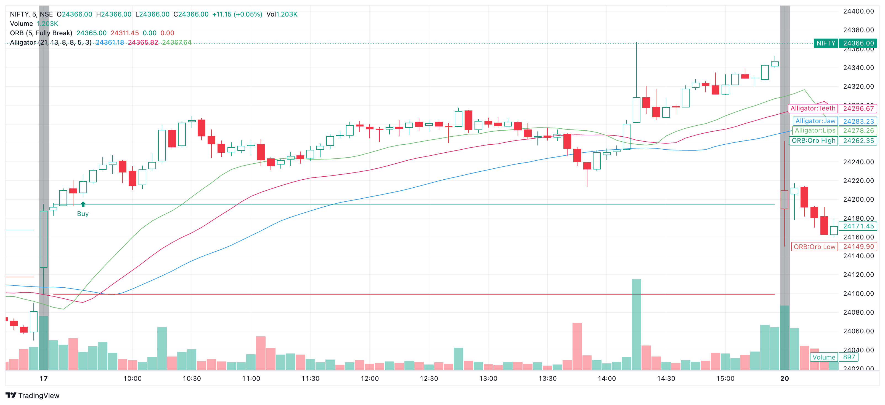
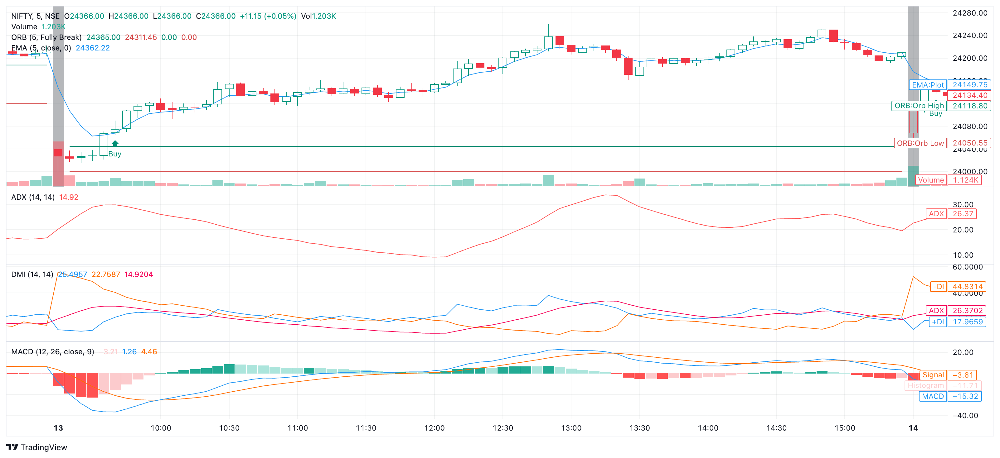
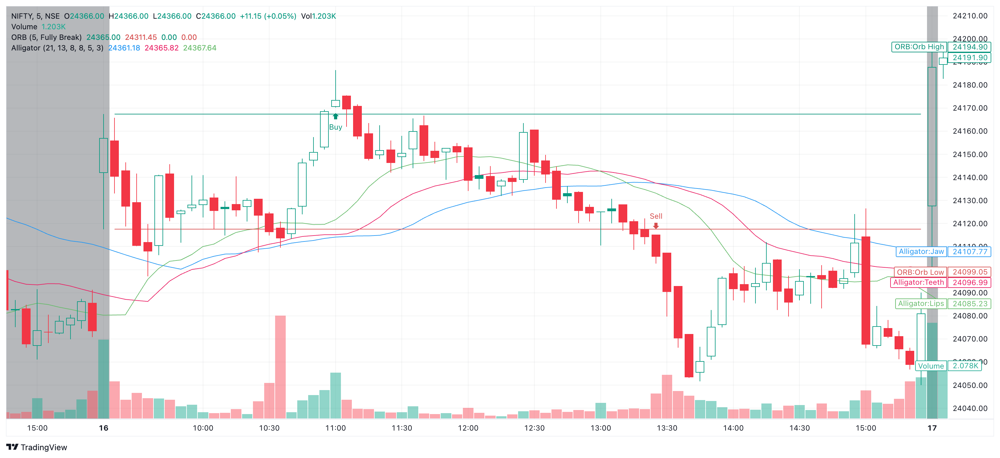
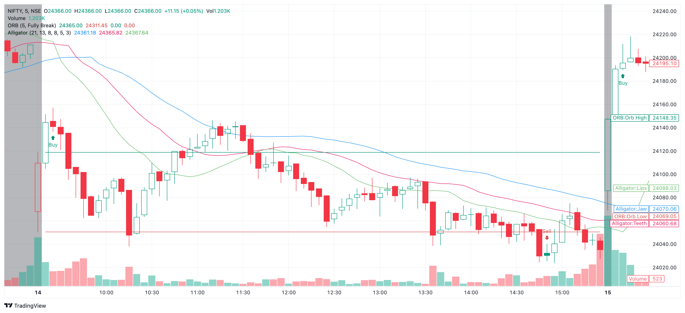
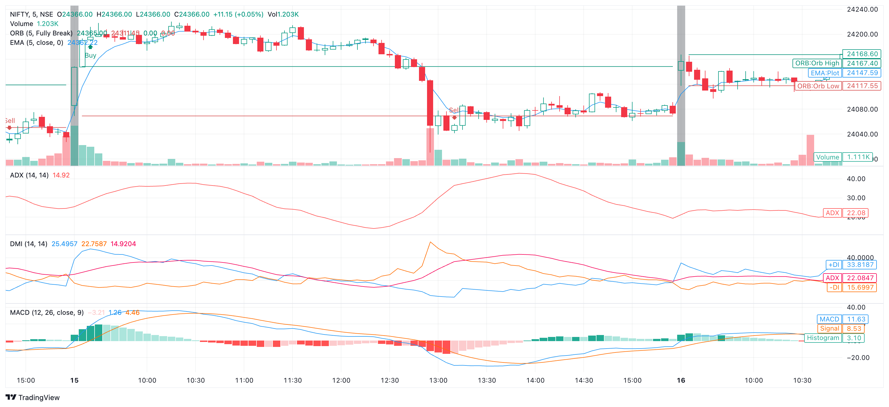
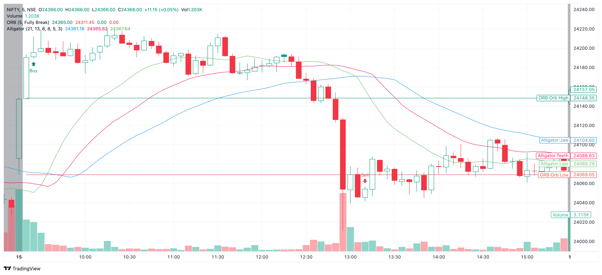

> Set Up Plan
- ORB
- Alligator
- HA candle confirm with ORB and trend should be there
- ORB breakout → strong candle → volume → Alligator → ADX → available room → entry

## Good signal


2-


## Flase signal


2-


3-


## Reverse signal

